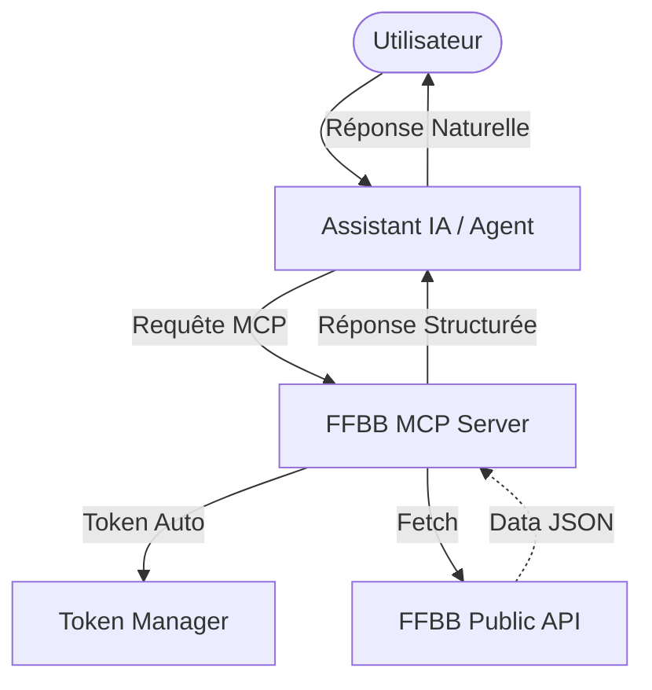

# 🏀 FFBB MCP Server

[](https://modelcontextprotocol.io)
[](https://www.python.org)
[](https://www.ffbb.com)
[](LICENSE)

> Un pont intelligent entre les données de la **Fédération Française de Basketball** et les assistants IA du futur.

Le serveur **FFBB MCP** permet à votre IA (Claude Desktop, Google Antigravity, Cursor, etc.) d'accéder nativement et en temps réel aux calendriers, classements et résultats du basketball français.

---

## 🏗️ Architecture

Le serveur agit comme une interface normalisée entre les agents IA et l'API FFBB, gérant l'authentification et offrant un filtrage sémantique intelligent.



---

## ✨ Fonctionnalités Clés

- **⚡ Temps Réel** : Accès aux scores live via `ffbb_get_lives` ou la ressource `ffbb://lives`.
- **🔍 Recherche Puissante** : Recherche globale via `ffbb_multi_search` (Clubs, Salles, Compétitions, Tournois, Terrains...).
- **📋 Calendriers & Résultats** : Historique et matchs à venir pour n'importe quelle équipe.
- **🏆 Classements** : Positions actualisées dans toutes les poules (Nationale, Régionale, Départementale).
- **📦 Ressources Directes** : Accès simplifié aux données via URIs (`ffbb://competition/{id}`, `ffbb://poule/{id}`).
- **💡 Prompts Intelligents** : Modèles prêts à l'emploi (`analyze-match`, `find-club`) pour guider l'IA.
- **🛠️ Zero Config Auth** : Les jetons d'accès sont récupérés automatiquement, aucune clé API manuelle n'est nécessaire.

---

## 🚀 Installation & Lancement

```bash
# 1. Cloner le repo
git clone https://github.com/nickdesi/FFBB-MCP-Server.git
cd FFBB-MCP-Server

# 2. Setup de l'environnement
python -m venv .venv
source .venv/bin/activate
pip install -e "."

# 3. Tester en local (MCP Inspector)
npx @modelcontextprotocol/inspector python -m ffbb_mcp
```

---

## ⚙️ Intégration IDE & Desktop

### 🪐 Google Antigravity (Gemini Code Assist / CLI)

Éditez votre fichier `~/.gemini/settings.json` :

```json
{
  "mcpServers": {
    "ffbb": {
      "command": "python",
      "args": ["-m", "ffbb_mcp"],
      "cwd": "/votre/chemin/FFBB-MCP-Server"
    }
  }
}
```

### 💻 VS Code (Roo Code / Cline)

Installez l'extension et configurez la source :

```json
{
  "mcpServers": {
    "ffbb": {
      "command": "/votre/chemin/.venv/bin/python",
      "args": ["-m", "ffbb_mcp"],
      "cwd": "/votre/chemin/FFBB-MCP-Server"
    }
  }
}
```

### 🧠 Claude Desktop

Éditez `~/Library/Application Support/Claude/claude_desktop_config.json` :

```json
{
  "mcpServers": {
    "ffbb": {
      "command": "/votre/chemin/.venv/bin/python",
      "args": ["-m", "ffbb_mcp"],
      "cwd": "/votre/chemin/FFBB-MCP-Server"
    }
  }
}
```

---

## 🤖 Guide de Survie pour Agents IA (Best Practices)

Pour les développeurs d'agents, ce serveur a été optimisé pour une utilisation sémantique :

1. **Fiabilité Max** : Ne tentez pas de deviner les IDs. Utilisez `ffbb_search_organismes` pour trouver le club, puis listez les équipes via `ffbb_get_organisme`.
2. **Filtrage Intelligent** : Les agents doivent utiliser les indices de texte (ex: "Equipe 2", "U11M") pour filtrer les résultats d'engagement avant d'appeler `ffbb_get_poule`.
3. **Gestion des Alias** : Le serveur supporte les recherches par acronymes si l'agent est capable de faire le lien (ex: SCBA -> Stade Clermontois).

---

## 📚 Source & Crédits

- **Données** : Fédération Française de Basketball.
- **Core Library** : [`ffbb-api-client-v2`](https://github.com/Rinzler78/FFBBApiClientV2_Python).
- **Maintenance** : Nicolas De Simone.

---

*Fait avec ❤️ par et pour les passionnés de basket.*
