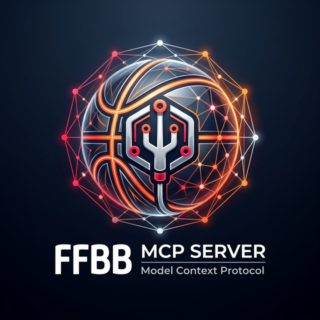
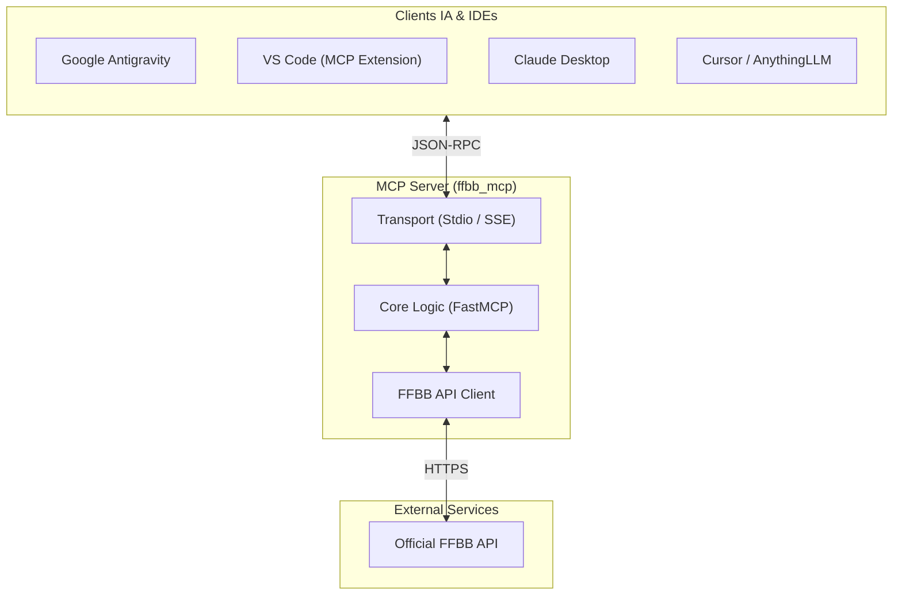

# 🏀 FFBB MCP Server

<p align="center">
  
  <br />
  <b>Le pont entre l'IA et le Basketball français.</b>
  <br />
  <i>Statistiques, calendriers, classements et lives officiels FFBB directement dans vos LLMs.</i>
</p>

<p align="center">
  
  
  <a href="https://smithery.ai/server/ffbb-mcp-server"></a>
  <a href="https://smithery.ai/servers/nickdesi/mcpffbb"></a>
  
</p>

---

## 🌟 Aperçu

Le serveur **FFBB MCP** expose les données de la Fédération Française de Basketball (FFBB). Il permet aux agents IA (comme Claude, Gemini, Cursor) de naviguer intelligemment dans l'écosystème du basket français : des ligues nationales aux championnats départementaux.

### 🏗️ Architecture


```mermaid
flowchart TD
    subgraph Clients ["Clients IA & IDEs"]
        direction TB
        A1["Google Antigravity"]
        A2["VS Code (MCP Extension)"]
        A3["Claude Desktop"]
        A4["Cursor / AnythingLLM"]
    end

    subgraph Server ["MCP Server (ffbb_mcp)"]
        direction TB
        B["Transport (Stdio / SSE)"]
        C["Core Logic (FastMCP)"]
        D["FFBB API Client"]
    end

    subgraph Remote ["External Services"]
        E["Official FFBB API"]
    end

    Clients <-->|JSON-RPC| B
    B <--> C
    C <--> D
    D <-->|HTTPS| E
```

## 🌐 Connecter votre assistant IA (Clients)

Le serveur gère nativement le transport **SSE (Streamable HTTP)** sur `https://ffbb.desimone.fr/mcp` et le transport **Stdio** en local via `uvx`.

Trouvez la configuration correspondant à votre outil préféré ci-dessous :

### Claude Desktop

Ajoutez ce bloc dans votre configuration (souvent `~/.config/Claude/claude_desktop_config.json` ou `%APPDATA%\Claude\claude_desktop_config.json`) pour utiliser la version distante :

```json
{
  "mcpServers": {
    "ffbb": {
      "command": "uvx",
      "args": [
        "--from",
        "git+https://github.com/nickdesi/FFBB-MCP-Server.git",
        "ffbb_mcp"
      ]
    }
  }
}
```

### Claude Code

Ajoutez le serveur distant avec la commande CLI native :

```shell
claude mcp add --transport http ffbb https://ffbb.desimone.fr/mcp
```

*Alternative locale via uvx :*

```shell
claude mcp add ffbb uvx --from "git+https://github.com/nickdesi/FFBB-MCP-Server.git" ffbb_mcp
```

### Cursor

1. Allez dans **Settings** > **Features** > **MCP Servers**.
2. Cliquez sur **+ Add New MCP Server**.
3. Configurez selon votre préférence :
   - **Mode Remote (Rapide)** : Type `sse`, URL `https://ffbb.desimone.fr/mcp`
   - **Mode Local** : Type `command`, Command `uvx --from git+https://github.com/nickdesi/FFBB-MCP-Server.git ffbb_mcp`

### Gemini CLI

Ajoutez le serveur dans `~/.gemini/settings.json` :

```json
{
  "mcpServers": {
    "ffbb": {
      "httpUrl": "https://ffbb.desimone.fr/mcp"
    }
  }
}
```

### Google Antigravity

Ajoutez simplement l'URL dans le fichier de configuration de l'espace de travail (`mcp_config.json`) :

```json
{
  "mcpServers": {
    "ffbb_mcp": {
      "serverUrl": "https://ffbb.desimone.fr/mcp"
    }
  }
}
```

### AnythingLLM

1. Allez dans les paramètres et locatez les MCP Servers.
2. Ajoutez un serveur de type `streamable` avec l'URL :
`https://ffbb.desimone.fr/mcp`

### Smithery

Vous pouvez installer ce serveur pour Claude Desktop directement avec Smithery CLI en utilisant l'URL du repository :

```bash
npx -y @smithery/cli@latest install @nickdesi/mcpffbb --client claude
```

---

## 🛠️ Outils Disponibles

| Catégorie | Outils | Description |
| --------- | -------- | ----------- |
| **Lives** | `ffbb_get_lives` | Scores en direct de tous les matchs en cours. |
| **Search** | `ffbb_multi_search` | Recherche globale (clubs, compétitions, salles). |
| **Club** | `ffbb_calendrier_club` | Matchs à venir pour un club spécifique. |
| **Stats** | `ffbb_get_classement` | Classement détaillé d'une poule/groupe. |

> [!TIP]
> Voir la [Référence complète des caractéristiques (Outils & Prompts)](docs/TOOLS_REFERENCE.md) pour la liste exhaustive.

---

## 🎭 Prompts Prédéfinis

Le serveur expose également un prompt prédéfini (standard MCP) pour initialiser un agent expert sur ces données :

- `expert_basket` : Configure le LLM pour agir en tant qu'assistant expert en basketball français, incluant les workflows de recherche par défaut et les directives pour l'utilisation des outils. Idéal en tant que *System Prompt* pour l'agent.

---

## 🔧 Troubleshooting (FAQ)

- **Erreur 404 sur /mcp** : Assurez-vous d'utiliser `https` et non `http`.
- **Délai de réponse** : L'API FFBB peut parfois être lente, augmentez le timeout de votre client si possible.
- **WebSocket / SSE** : Sur Nginx Proxy Manager, activez impérativement **"Websockets Support"**.
- **Monitoring** : Si le serveur semble inactif, vous pouvez vérifier son état via l'endpoint de santé : `https://ffbb.desimone.fr/health`.

---

## ⚠️ Continuité & Self-Hosting

L'URL officielle recommandée `https://ffbb.desimone.fr/mcp` est une **instance communautaire hébergée gracieusement**, sans *Service Level Agreement* (SLA) ni garantie de disponibilité à 100%. Bien que configurée pour être robuste, elle peut subir des interruptions liées à l'hébergement ou à l'API FFBB elle-même.

**Si vous dépendez de cet outil pour des workflows critiques :**

- **Fallback local** : Si l'instance distante tombe, repassez sur la commande locale `uvx --from "git+https://github.com/nickdesi/FFBB-MCP-Server.git" ffbb_mcp`.
- **Self-Hosting (Recommandé)** : Hébergez votre propre instance MCP. Référez-vous à la documentation [docs/COOLIFY_DEPLOYMENT.md](docs/COOLIFY_DEPLOYMENT.md) pour les instructions avec Coolify/Docker.
  - **Sécurité et Configuration** : Sécurisez votre instance en définissant les variables d'environnement suivantes :
    - `ALLOWED_HOSTS` : Noms de domaine autorisés (ex: `ffbb.mondomaine.fr`)
    - `ALLOWED_ORIGINS` : Origines autorisées (ex: `https://ffbb.mondomaine.fr`)
    - `ENABLE_DNS_PROTECTION` : Mettre à `true` pour activer la protection contre le DNS Rebinding.
    - `PUBLIC_URL` : URL publique de votre instance MCP (ex: `https://ffbb.mondomaine.fr/mcp`).

---

## 👨‍💻 Développement

Consultez le guide [CONTRIBUTING.md](CONTRIBUTING.md) pour installer l'environnement de développement et soumettre des PRs.

Pour le déploiement sur votre propre serveur, voir [docs/COOLIFY_DEPLOYMENT.md](docs/COOLIFY_DEPLOYMENT.md).

## 📄 Licence

Ce projet est sous licence [MIT](LICENSE).
