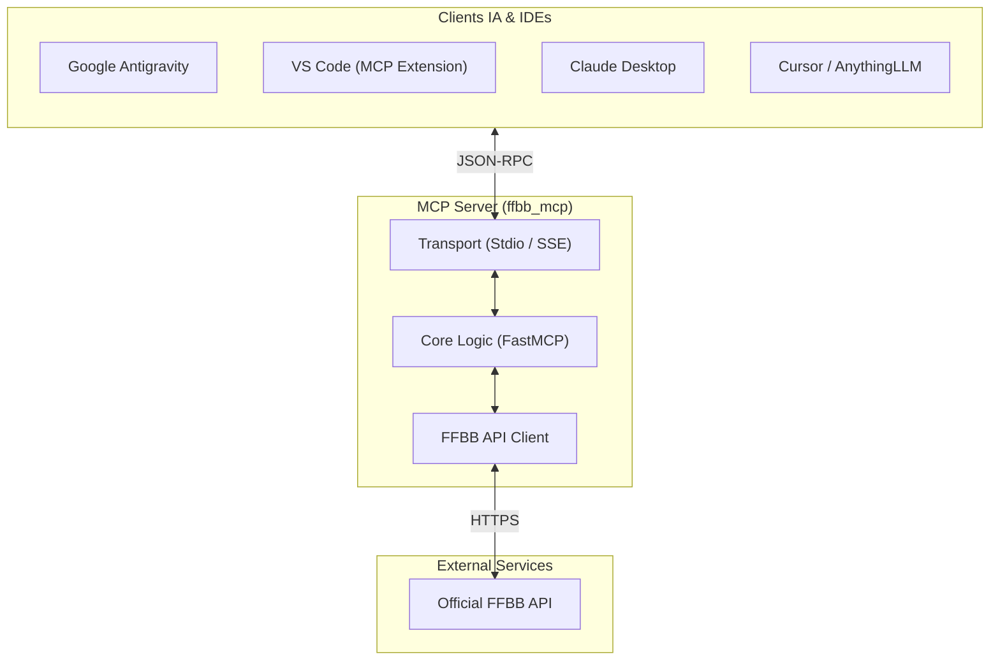

# 🏀 FFBB MCP Server

<p align="center">
  
  <br />
  <b>Le pont entre l'IA et le Basketball français.</b>
  <br />
  <i>Statistiques, calendriers, classements et lives officiels FFBB directement dans vos LLMs.</i>
</p>

<p align="center">
  
  
  
</p>

---

## 🌟 Aperçu

Le serveur **FFBB MCP** expose les données de la Fédération Française de Basketball (FFBB). Il permet aux agents IA (comme Claude, Gemini, Cursor) de naviguer intelligemment dans l'écosystème du basket français : des ligues nationales aux championnats départementaux.

### 🏗️ Architecture


```mermaid
flowchart TD
    subgraph Clients ["Clients IA & IDEs"]
        direction TB
        A1["Google Antigravity"]
        A2["VS Code (MCP Extension)"]
        A3["Claude Desktop"]
        A4["Cursor / AnythingLLM"]
    end

    subgraph Server ["MCP Server (ffbb_mcp)"]
        direction TB
        B["Transport (Stdio / SSE)"]
        C["Core Logic (FastMCP)"]
        D["FFBB API Client"]
    end

    subgraph Remote ["External Services"]
        E["Official FFBB API"]
    end

    Clients <-->|JSON-RPC| B
    B <--> C
    C <--> D
    D <-->|HTTPS| E
```

---

## 🚀 Installation & Connexion

### 1. Mode Remote (Recommandé) ✨

Connectez-vous directement à l'instance hébergée. **Aucune installation Python requise.**

- **URL de connexion** : `https://ffbb.desimone.fr/mcp`

### 2. Mode Local (via uvx)

Lancez le serveur à la volée sans rien installer :

```bash
uvx --from "git+https://github.com/nickdesi/FFBB-MCP-Server.git" ffbb_mcp
```

---

## ⚙️ Configuration par Client

<details>
<summary><b>Claude Desktop</b></summary>

Ajoutez ceci à votre configuration (`claude_desktop_config.json`) :

```json
{
  "mcpServers": {
    "ffbb": {
      "command": "npx",
      "args": [
        "-y",
        "@modelcontextprotocol/server-remote",
        "--url",
        "https://ffbb.desimone.fr/mcp"
      ]
    }
  }
}
```

</details>

<details>
<summary><b>Cursor</b></summary>

1. **Settings** > **Features** > **MCP Servers**.
2. **+ Add New MCP Server**.
3. **Name**: `FFBB` | **Type**: `command`
4. **Command**: `uvx --from git+https://github.com/nickdesi/FFBB-MCP-Server.git ffbb_mcp`

</details>

<details>
<summary><b>Google Antigravity</b></summary>

Ajoutez votre serveur dans `mcp_config.json` :

```json
{
  "mcpServers": {
    "ffbb_mcp": {
      "url": "https://ffbb.desimone.fr/mcp"
    }
  }
}
```

</details>

<details>
<summary><b>VS Code (Extension MCP)</b></summary>

Si vous utilisez l'extension MCP pour VS Code :

1. Ouvrez les réglages de l'extension.
2. Ajoutez un nouveau serveur de type **SSE**.
3. **URL** : `https://ffbb.desimone.fr/mcp`

</details>

<details>
<summary><b>AnythingLLM</b></summary>

Ajoutez un serveur MCP de type `streamable` :

- **URL** : `https://ffbb.desimone.fr/mcp`

</details>

---

## 🛠️ Outils Disponibles

| Catégorie | Outils | Description |
|-----------|---------|-------------|
| **Lives** | `ffbb_get_lives` | Scores en direct de tous les matchs en cours. |
| **Search** | `ffbb_multi_search` | Recherche globale (clubs, compétitions, salles). |
| **Club** | `ffbb_calendrier_club` | Matchs à venir pour un club spécifique. |
| **Stats** | `ffbb_get_classement` | Classement détaillé d'une poule/groupe. |

> [!TIP]
> Voir la [Référence complète des outils](docs/CLI_REFERENCE.md) pour la liste exhaustive des 15+ outils.

---

## 🔧 Troubleshooting (FAQ)

- **Erreur 404 sur /mcp** : Assurez-vous d'utiliser `https` et non `http`.
- **Délai de réponse** : L'API FFBB peut parfois être lente, augmentez le timeout de votre client si possible.
- **WebSocket / SSE** : Sur Nginx Proxy Manager, activez impérativement **"Websockets Support"**.

---

## 👨‍💻 Développement

Consultez le guide [CONTRIBUTING.md](CONTRIBUTING.md) pour installer l'environnement de développement et soumettre des PRs.

## 📄 Licence

Ce projet est sous licence [MIT](LICENSE).
