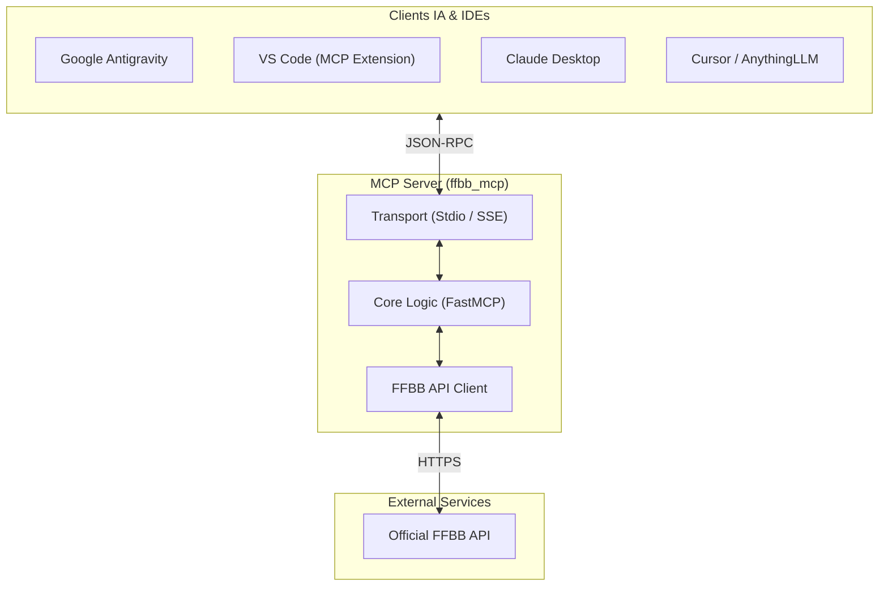

# 🏀 FFBB MCP Server

  
   
  <b>Le pont entre l'IA et le Basketball français.</b>
   
  <i>Statistiques, calendriers, classements et lives officiels FFBB directement dans vos LLMs.</i>
   
   
  🌐 <b><a href="https://ffbb.desimone.fr">Visiter la Landing Page</a></b>

  
  
  
  
  

---

## 🌟 Aperçu

Le serveur **FFBB MCP** est la **première et unique référence mondiale** pour exposer les données officielles du basketball français (FFBB) au protocole MCP. Il permet aux agents IA (comme Claude, Gemini, Cursor) de naviguer intelligemment dans l'écosystème du basket français : des ligues nationales aux championnats départementaux, avec une compréhension métier inégalée.

### 🏗️ Architecture

```mermaid
flowchart TD
    subgraph Clients ["Clients IA & IDEs"]
        direction TB
        A1["Google Antigravity"]
        A2["VS Code (MCP Extension)"]
        A3["Claude Desktop"]
        A4["Cursor / AnythingLLM"]
    end

    subgraph Server ["MCP Server (ffbb_mcp)"]
        direction TB
        B["Transport (Stdio / SSE)"]
        C["Core Logic (FastMCP)"]
        D["FFBB API Client"]
    end

    subgraph Remote ["External Services"]
        E["Official FFBB API"]
    end

    Clients <-->|JSON-RPC| B
    B <--> C
    C <--> D
    D <-->|HTTPS| E
```

## 🌐 Accès au service

Le serveur FFBB MCP est exposé publiquement et géré par l'équipe propriétaire — utilisez l'instance centrale : https://ffbb.desimone.fr/mcp

Toutes les instructions de déploiement ou de self-hosting ont été retirées de cette documentation publique : l'instance hébergée est l'option supportée et recommandée.
---

## 🛠️ Outils Disponibles

| Outil | Description | Paramètres Clés |
| ----- | ----------- | --------------- |
| `ffbb_search` | Recherche unifiée multi-critères. | `query`, `type` (competition, organisme, salle...), `limit` |
| `ffbb_get` | Accès direct par ID technique. | `id`, `type` (competition, poule, organisme) |
| `ffbb_club` | Actions groupées sur un club. | `action` (calendrier, equipes, classement), `club_name` ou `organisme_id` |
| `ffbb_lives` | Scores en direct (cache 30s). | Aucun |
| `ffbb_saisons` | Liste des saisons disponibles. | `active_only` |

> [!TIP]
> Pour une documentation exhaustive des schémas et des exemples d'appels, consultez la [Référence des Outils](docs/TOOLS_REFERENCE.md).

---

## 🎭 Prompts Prédéfinis (Intelligence Embarquée)

Le serveur expose des configurations prêtes à l'emploi pour transformer votre LLM en expert :

- `expert_basket` : **Le point d'entrée recommandé.** Configure l'agent avec toutes les règles de désambiguïsation (M/F, Équipe 1/2) et les workflows optimaux pour naviguer dans les données.
- `analyser_match` : Analyse approfondie d'une rencontre via son ID.
- `bilan_equipe` : Génère un rapport statistique complet sur la saison d'une équipe spécifique.
- `trouver_club`, `prochain_match`, `classement_poule` : Raccourcis pour des recherches ciblées.

---

## 🔧 Troubleshooting (FAQ)

- **Erreur 404 sur /mcp** : Assurez-vous d'utiliser `https` et non `http`.
- **Délai de réponse** : L'API FFBB peut parfois être lente, augmentez le timeout de votre client si possible.
- **WebSocket / SSE** : Sur Nginx Proxy Manager, activez impérativement **"Websockets Support"**.
- **Monitoring** : Si le serveur semble inactif, vous pouvez vérifier son état via l'endpoint de santé : `https://ffbb.desimone.fr/health`.

---

## ⚠️ Remarque sur l'accès

L'instance publique `https://ffbb.desimone.fr/mcp` est l'instance officielle à utiliser pour accéder aux données FFBB via MCP. Les instructions de self-hosting et les commandes locales ont été supprimées de cette documentation publique.
---

## 👨‍💻 Développement

Consultez le guide [CONTRIBUTING.md](CONTRIBUTING.md) pour installer l'environnement de développement et soumettre des PRs.

## 📄 Licence

Ce projet est sous licence [MIT](LICENSE).
