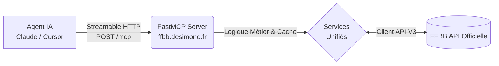

# 🏀 FFBB MCP Server

<p align="center">
  
</p>

<h3 align="center">Le pont absolu entre l'Intelligence Artificielle et le Basketball français.</h3>

<p align="center">
  Statistiques, calendriers, classements et scores en direct officiels de la FFBB, conçus spécifiquement pour les LLMs via le protocole MCP.
  <br /><br />
  🌐 <b><a href="https://ffbb.desimone.fr">Visiter la Landing Page</a></b>
</p>

<p align="center">
  
  
  <a href="https://smithery.ai/server/ffbb-mcp-server"></a>
  
</p>

<p align="center">
  <em>Dernière mise à jour : 20 Avril 2026 • Propulsé par <a href="https://pypi.org/project/FFBBApiClientV3/">FFBBApiClientV3</a></em>
</p>

---

## 🌟 Aperçu

Le serveur **FFBB MCP** est la **première et unique référence mondiale** permettant d'exposer les données officielles du basketball français (FFBB) au protocole MCP (Model Context Protocol).

Il permet aux assistants IA (Claude, Gemini, Cursor) de naviguer intelligemment dans tout l'écosystème du basket français : des ligues nationales aux championnats régionaux et départementaux, avec une compréhension logique métier inégalée (résolution de noms de clubs ambigus, gestion des phases et poules, etc.).

> **L'instance publique canonique :**  
> 👉 `https://ffbb.desimone.fr/mcp`  
> Tous les clients IA doivent pointer vers cette URL. Transport : **Streamable HTTP** (spec MCP 2025-11-25).

---

## 🚀 Connecter votre assistant IA

L'URL de l'instance publique est prête à l'emploi. Voici comment l'intégrer dans vos outils favoris :

### Claude Desktop
Ajoutez cette configuration dans votre `claude_desktop_config.json` :

```json
{
  "mcpServers": {
    "ffbb": {
      "httpUrl": "https://ffbb.desimone.fr/mcp"
    }
  }
}
```

### Cursor / VS Code (Extension MCP) / AnythingLLM
Dans l'interface de gestion MCP de l'éditeur :

1. Type : `Streamable HTTP` (ou `HTTP` selon le client)
2. URL : `https://ffbb.desimone.fr/mcp`

### Smithery (Intégration automatisée)

```bash
npx -y @smithery/cli@latest install @nickdesi/mcpffbb --client claude --mcp-url https://ffbb.desimone.fr/mcp
```

---

## 🛠️ Boîte à Outils (Tools)

Récemment refondu pour maximiser les performances des LLMs, le serveur propose 11 outils unifiés et sur-puissants :

### 📊 Outils Prêts à l'Emploi (Recommandés)

| Outil | Description | Paramètres Clés |
| ----- | ----------- | --------------- |
| ⚡ **`ffbb_bilan`** | Obtenir le bilan complet de A à Z (toutes phases) d'une équipe, ses classements & résultats en 1 appel. | `club_name`, `categorie`, `force_refresh` |
| ⚡ **`ffbb_team_summary`** | Le résumé parfait pour un agent : bilan, phase courante, dernier match joué et prochain match. | `club_name`, `categorie` |
| 🏀 **`ffbb_last_result`** | Le score et détail du tout dernier match joué par l'équipe. | `categorie`, `club_name`, `force_refresh` |
| 🗓️ **`ffbb_next_match`** | Les infos du prochain match officiel à venir (adversaire, date, salle). | `categorie`, `club_name`, `force_refresh` |

### 🔍 Outils d'Exploration & Data Brute

| Outil | Description | Paramètres Clés |
| ----- | ----------- | --------------- |
| `ffbb_search` | Le moteur de recherche global (clubs, compétitions, salles, matchs, engagements, formations). | `query`, `type`, `limit` |
| `ffbb_resolve_team` | Résout et trouve l'ID/les infos exactes d'une équipe via une chaîne (ex: «U11M1»). | `club_name`, `categorie` |
| `ffbb_get` | Accès direct aux classements complets et matchs par ID technique. | `id`, `type`, `force_refresh` |
| `ffbb_club` | Explorer le planning complet, l'ensemble des équipes ou tous les classements d'un club. | `action`, `club_name`, `force_refresh` |
| `ffbb_bilan_saison` | Bilan détaillé toutes phases pour une équipe précise. | `organisme_id`, `force_refresh` |
| `ffbb_lives` | Récupère tous les matchs actuellement en direct en France. | *Aucun* |
| `ffbb_saisons` | Liste et détermine la saison FFBB en cours. | `active_only` |
| `ffbb_version` | Diagnostics runtime : version, transport, TTLs de cache actifs. | *Aucun* |

#### Détail de `ffbb_search` (v0.4.0)

L'outil `ffbb_search` couvre désormais **9 index Meilisearch** et supporte le filtrage et tri natifs :

| Type | Description |
| --- | --- |
| `all` | Recherche globale sur tous les index (défaut) |
| `competitions` | Compétitions officielles |
| `organismes` | Clubs, comités, ligues |
| `rencontres` | Matchs et rencontres |
| `salles` | Salles et gymnases |
| `pratiques` | Lieux de pratique |
| `terrains` | Terrains de basket |
| `tournois` | Tournois |
| `engagements` | **Engagements d'équipes** *(nouveau v0.4.0)* |
| `formations` | **Formations et stages** *(nouveau v0.4.0)* |

**Nouveaux paramètres v0.4.0 :**
- `filter_by` *(optionnel)* — Filtre Meilisearch natif (ex: `codePostal = "63000"`)
- `sort` *(optionnel)* — Tri Meilisearch natif (ex: `["libelle:asc"]`)

---

## 🏗️ Architecture Technique


```mermaid
flowchart LR
    A["Agent IA\nClaude / Cursor"] -->|"Streamable HTTP\nPOST /mcp"| B("FastMCP Server\nffbb.desimone.fr")
    B -->|"Logique Métier & Cache"| C{"Services\nUnifiés"}
    C <-->|"Client API V3"| D[("FFBB API Officielle")]
```

- **Transport :** Streamable HTTP (spec MCP 2025-11-25) — endpoint unique `/mcp` acceptant POST (JSON-RPC) et GET.
- **Réduction de contexte :** Le `Service Layer` consolide de nombreux micro-appels FFBB en réponses JSON concises, économisant massivement les tokens de votre LLM.
- **Cache Intelligent Multi-niveaux :** Un système de TTL dynamique s'adapte au calendrier (mercredi/weekend live, périodes de saisies tardives, hors-saison) pour garantir une fraîcheur maximale (15s en live) tout en optimisant les performances hors match (jusqu'à 24h).
- **Anti-Burst & Déduplication :** Protection contre les abus via une déduplication des requêtes en vol couplée à un rate-limiter strict.
- **Auto-résolution :** L'outil `ffbb_club` auto-résout désormais les `poule_id` pour les classements par phase et met en avant l'équipe concernée.

---

## 🎭 Intelligence Embarquée (Prompts)

Ce serveur expose des **Prompts** natifs pour donner instantanément de l'expertise métier à votre agent :

- 🎓 `expert_basket` : Injecte les règles métier complexes de la FFBB à votre agent (catégories, désambiguïsation, [règles de navigation multi-phases](docs/rules_ffbb.md), utilisation optimale des outils unifiés). **Fortement recommandé.**
- 📈 `bilan_equipe` : Prompt guidé pour sortir un rapport exhaustif d'une équipe.
- 🏟️ `analyser_match` / `prochain_match` : Workflows en 1 clic pour décortiquer une rencontre spécifique.

---

## 🔧 FAQ : Comment intégrer et dépanner l'API FFBB avec l'IA ?

- **Mon IA ne trouve pas mon équipe locale :** Donnez-lui toujours le nom précis du club (ex: `Vichy` au lieu de `JA Vichy` si c'est ambigu) et utilisez **`ffbb_search`**.
- **L'agent boucle sur des IDs introuvables :** Rappelez à l'agent d'utiliser `ffbb_bilan` avec le paramètre `club_name` pour qu'il fasse lui-même la résolution interne.
- **Progrès sur les appels lents :** Les outils `ffbb_bilan`, `ffbb_team_summary` et `ffbb_bilan_saison` émettent maintenant des notifications de progression aux clients qui les supportent (Claude Desktop, Cursor…). Aucun changement d'API nécessaire.
- **Le club contient une apostrophe (ex: `Jeanne d'Arc`) :** ✅ Supporté depuis la **v0.4.1** — les apostrophes typographiques (`'`, `'`, `` ` ``) sont automatiquement normalisées avant la recherche.
- **Mon club n'a qu'une seule équipe et elle n'a pas de numéro :** ✅ Supporté depuis la **v0.4.1** — une requête `U11M1` trouve désormais une équipe enregistrée sans numéro (numéro 1 implicite). Le champ `note` de l'équipe retournée l'indique explicitement.
- **Erreurs 404 :** Assurez-vous d'utiliser le endpoint canonique exact `https://ffbb.desimone.fr/mcp`.
- **Serveur inactif :** Vérifiez le Health Check `https://ffbb.desimone.fr/health`.

---

## 👨‍💻 Contribution & Sous le capot

Pour découvrir la documentation technique exhaustive, le guide de contribution et les détails internes :
1. [Références des outils complets (🛠️)](docs/TOOLS_REFERENCE.md)
2. [Architecture détaillée (🏗️)](docs/ARCHITECTURE.md)
3. [Guide de contribution (👨‍💻)](CONTRIBUTING.md)

---
<p align="center">
  <i>Construit avec ❤️ pour la communauté du basket. Ce projet non-officiel n'est pas affilié à la Fédération Française de BasketBall.</i>
</p>

