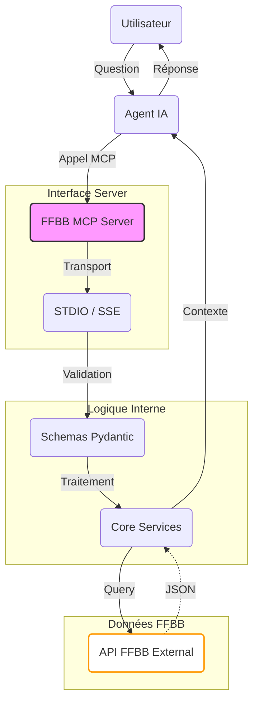

# 🏀 FFBB MCP Server

<p align="center">
  
  <br />
  <b>Connectez vos agents IA aux données officielles du Basket français.</b>
</p>

<p align="center">
  <a href="https://github.com/nickdesi/FFBB-MCP-Server/actions"></a>
  <a href="https://www.python.org"></a>
  <a href="https://modelcontextprotocol.io"></a>
  <a href="https://www.ffbb.com"></a>
  <a href="LICENSE"></a>
</p>

---

## 📖 Présentation

Le serveur **FFBB MCP** est une passerelle intelligente entre le **Model Context Protocol (MCP)** et les données de la **Fédération Française de Basketball**. Il permet à vos assistants IA (Claude, Gemini, Cursor) de consulter en temps réel :

* 🏆 **Compétitions** : Championnats nationaux, régionaux et départementaux.
* 🏀 **Matchs** : Scores en direct, calendriers et résultats historiques.
* 🏢 **Clubs & Organismes** : Coordonnées, équipes engagées et salles.
* 📊 **Classements** : Tableaux de poules mis à jour instantanément.

---

## 🏗️ Architecture

Le serveur agit comme un pont sécurisé, gérant l'authentification automatique et optimisant les réponses pour une compréhension maximale par les LLMs.


```mermaid
graph TD
    User("Utilisateur") -->|Question| Agent("Agent IA")
    Agent -->|Appel MCP| Server("FFBB MCP Server")
    
    subgraph "Interface Server"
        Server -->|Transport| Transport("STDIO / SSE")
    end

    subgraph "Logique Interne"
        Transport -->|Validation| Schemas("Schemas Pydantic")
        Schemas -->|Traitement| Services("Core Services")
    end

    subgraph "Données FFBB"
        Services -->|Query| API("API FFBB External")
    end

    API -.->|JSON| Services
    Services -->|Contexte| Agent
    Agent -->|Réponse| User

    style Server fill:#f9f,stroke:#333,stroke-width:2px
    style API fill:#fff,stroke:#ff9800,stroke-width:2px
```

---

## ✨ Fonctionnalités Clés

* 🚀 **Performance** : Utilisation de recherches Meilisearch asynchrones pour des résultats instantanés.
* 🔐 **Zéro-Config** : Aucune clé API manuelle requise, les tokens sont gérés dynamiquement.
* 🏷️ **Sémantique** : Conçu spécifiquement pour que les agents IA comprennent les structures de données complexes du basket.
* 📡 **Multi-Mode** : Supporte à la fois le mode **Stdio** (local) et **SSE** (déploiement cloud).

---

## 🛠 Outils Disponibles

| Outil | Description | Paramètres Clés |
| :--- | :--- | :--- |
| `ffbb_multi_search` | Recherche globale | `nom` (ex: "Clermont") |
| `ffbb_equipes_club` | Liste les équipes d'un club | `organisme_id`, `filtre` |
| `ffbb_calendrier_club`| Calendrier d'un club | `club_name` ou `organisme_id` |
| `ffbb_get_classement` | Classement rapide | `poule_id` |
| `ffbb_get_lives` | Scores en temps réel | - |
| `ffbb_get_poule` | Détails d'un groupe | `poule_id` |
| `ffbb_search_*` | Recherches ciblées | `nom` (salles, terrains...) |

> [!TIP]
> Pour une documentation détaillée de chaque paramètre et des exemples de réponses, consultez la [Référence des Outils](docs/TOOLS_REFERENCE.md).

---

## 🚀 Installation Rapide

```bash
# 1. Installation du package
pip install ffbb-mcp

# 2. Test direct avec l'inspecteur MCP
npx @modelcontextprotocol/inspector python -m ffbb_mcp
```

---

## ⚙️ Configuration par Environnement

### 🪐 Google Antigravity (Gemini Code Assist / CLI)

Éditez votre fichier `~/.gemini/settings.json` :

```json
{
  "mcpServers": {
    "ffbb": {
      "command": "python",
      "args": ["-m", "ffbb_mcp"],
      "cwd": "/votre-chemin/FFBB-MCP-Server"
    }
  }
}
```

### 🧠 Claude Desktop

Éditez `~/Library/Application Support/Claude/claude_desktop_config.json` :

```json
{
  "mcpServers": {
    "ffbb": {
      "command": "/chemin/vers/venv/bin/python",
      "args": ["-m", "ffbb_mcp"]
    }
  }
}
```

### 💻 VS Code (Roo Code / Cline)

Installez l'extension et configurez la source :

```json
{
  "mcpServers": {
    "ffbb": {
      "command": "python",
      "args": ["-m", "ffbb_mcp"],
      "env": { "PYTHONPATH": "./src" }
    }
  }
}
```

---

## 🤖 Guide de Survie pour les Agents IA

> [!IMPORTANT]
> Pour une fiabilité optimale, suivez ce workflow :
>
> 1. Utilisez `ffbb_multi_search` pour confirmer l'ID d'un club ou d'une compétition.
> 2. Listez les équipes via `ffbb_equipes_club` pour récupérer l'ID de poule (`poule_id`).
> 3. Ne demandez jamais à l'utilisateur de fournir un ID technique.

> [!TIP]
> Si vous cherchez un club par son acronyme (ex: `JDA`), le serveur effectuera une recherche intelligente sur les noms complets.

---

## 🐳 Déploiement Cloud (Coolify / Docker)

Le serveur est prêt pour la production avec **SSE**.

1. **Variables d'env** :
   * `MCP_MODE=sse`
   * `PORT=9123`
2. **Build** : Utilisez le `Dockerfile` fourni.
3. **URL d'accès** : `https://votre-mcp.com/mcp`

---

## 📚 Crédits

* **Auteur** : Nicolas De Simone
* **Données** : Fédération Française de Basketball
* **Bibliothèque core** : [`ffbb-api-client-v3`](https://github.com/nickdesi/FFBBApiClientV3)

---
<p align="center">🏀 <i>L'IA au service du basketball français.</i></p>
