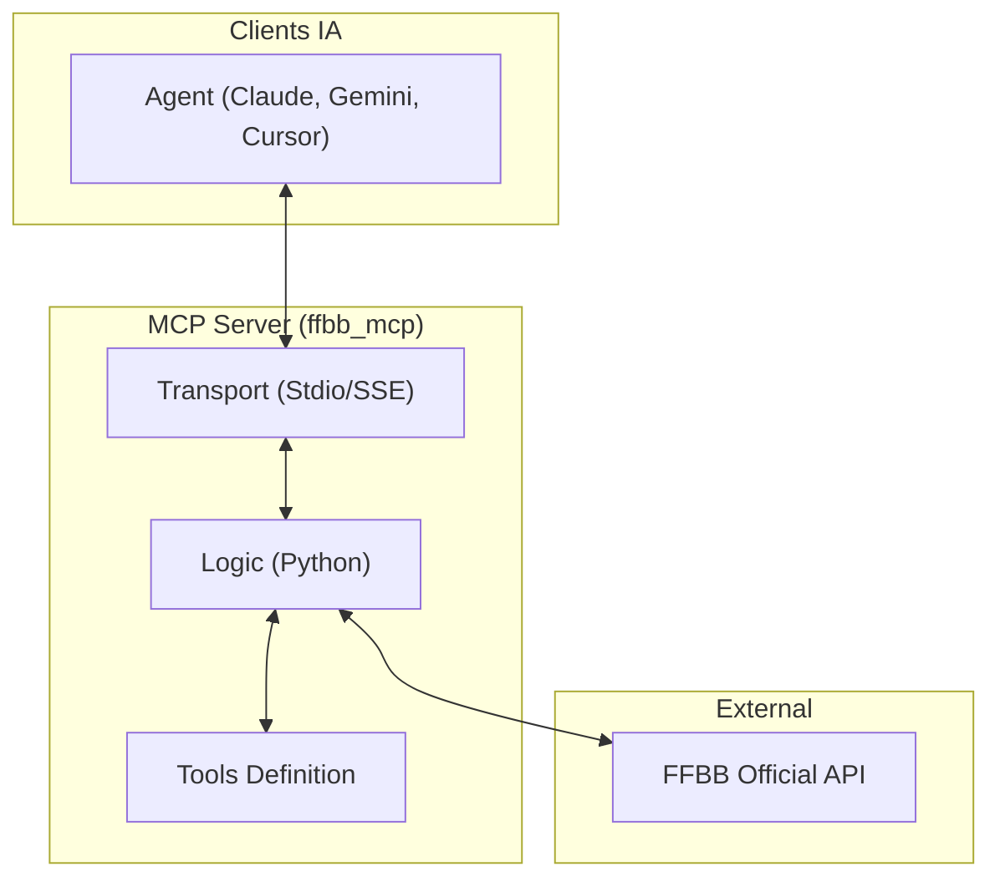

# 🏀 FFBB MCP Server

<p align="center">
  
  <br />
  <b>Connectez vos agents IA aux données officielles du Basket français.</b>
  <br />
  <i>Statistiques, calendriers, classements et lives directement dans vos outils de développement.</i>
</p>

<p align="center">
  
  
  
</p>

---

## 🌟 Aperçu

Le serveur **FFBB MCP** expose les données de la Fédération Française de Basketball (FFBB). Il permet aux agents IA (comme Claude, Gemini, Cursor) de naviguer intelligemment dans l'écosystème du basket français : des ligues nationales aux championnats départementaux.

### 🏗️ Architecture


```mermaid
flowchart TD
    subgraph "Clients IA"
        A["Agent (Claude, Gemini, Cursor)"]
    end

    subgraph "MCP Server (ffbb_mcp)"
        B["Transport (Stdio/SSE)"]
        C["Logic (Python)"]
        D["Tools Definition"]
    end

    subgraph "External"
        E["FFBB Official API"]
    end

    A <--> B
    B <--> C
    C <--> D
    C <--> E
```

---

## 🚀 Installation Rapide

### Installation via `pip`

```bash
pip install "ffbb-mcp @ git+https://github.com/nickdesi/FFBB-MCP-Server.git"
```

### Utilisation avec `npx` (via uv)

Si vous utilisez [uv](https://github.com/astral-sh/uv), vous pouvez lancer le serveur sans installation permanente :

```bash
uvx --from "git+https://github.com/nickdesi/FFBB-MCP-Server.git" ffbb_mcp
```

---

## 🛠️ Outils Disponibles

Le serveur propose une suite complète d'outils pour explorer le basket français :

| Outil | Description | Paramètres clés |
|-------|-------------|-----------------|
| `ffbb_multi_search` | Recherche globale multi-critères | `nom` (club, ville, etc.) |
| `ffbb_calendrier_club` | Matchs à venir d'un club | `organisme_id` |
| `ffbb_get_lives` | Scores en direct (tous matchs) | - |
| `ffbb_get_classement` | Classement d'une poule | `poule_id` |
| `ffbb_get_poule` | Détails complets d'un groupe | `poule_id` |
| `ffbb_search_*` | Recherches ciblées | `nom` (salles, terrains...) |

> [!TIP]
> Pour une documentation détaillée de chaque paramètre et des exemples de réponses, consultez la [Référence des Outils](docs/TOOLS_REFERENCE.md).

---

## ⚙️ Configuration

### Google Antigravity (Gemini)

Ajoutez ceci à votre configuration Antigravity :

```json
{
  "mcpServers": {
    "ffbb_mcp": {
      "command": "python3",
      "args": ["-m", "ffbb_mcp.server"]
    }
  }
}
```

### Claude Desktop

Modifiez `~/Library/Application Support/Claude/claude_desktop_config.json` :

```json
{
  "mcpServers": {
    "ffbb_mcp": {
      "command": "uv",
      "args": ["run", "--from", "git+https://github.com/nickdesi/FFBB-MCP-Server.git", "ffbb_mcp"]
    }
  }
}
```

### Cursor

1. Allez dans `Settings` > `Features` > `MCP Servers`.
2. Cliquez sur `+ Add New MCP Server`.
3. Name: `FFBB`. Type: `command`.
4. Command: `uv run --from git+https://github.com/nickdesi/FFBB-MCP-Server.git ffbb_mcp`

---

## 🐳 Déploiement

Le serveur est prêt pour la production via Docker ou **Coolify**.

```bash
docker build -t ffbb-mcp-server .
docker run -p 8000:8000 ffbb-mcp-server
```

> [!NOTE]
> En mode HTTP/SSE (utilisé par Coolify), le serveur écoute par défaut sur le port 8000.

---

## 🤖 Guide pour l'Agent IA

Lorsqu'un agent utilise ce serveur, il devrait suivre ce workflow :

1. **Exploration** : Commencer par `ffbb_multi_search` pour trouver un `organisme_id` (club).
2. **Contexte** : Utiliser `ffbb_equipes_club` pour lister les équipes engagées.
3. **Détails** : Récupérer le calendrier ou le classement via les IDs obtenus.

---

## 📄 Licence

Ce projet est sous licence [MIT](LICENSE).
