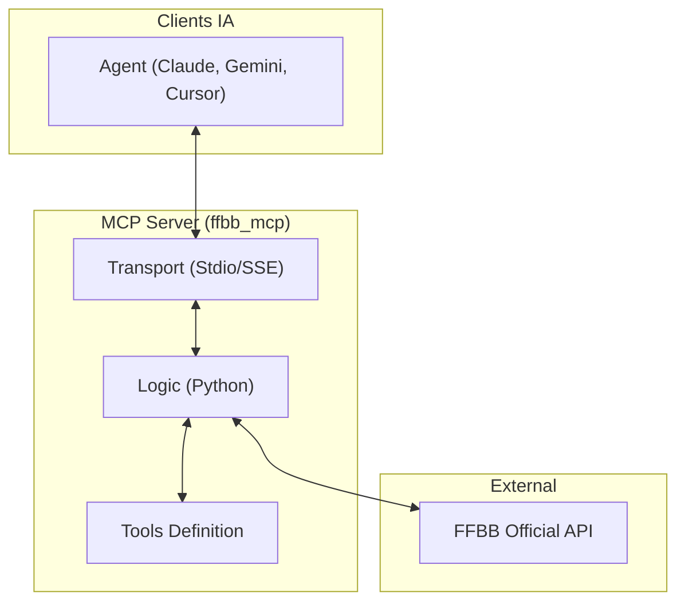

# 🏀 FFBB MCP Server

<p align="center">
  
  <br />
  <b>Le pont entre l'IA et le Basketball français.</b>
  <br />
  <i>Statistiques, calendriers, classements et lives officiels FFBB directement dans vos LLMs.</i>
</p>

<p align="center">
  
  
  
</p>

---

## 🌟 Aperçu

Le serveur **FFBB MCP** expose les données de la Fédération Française de Basketball (FFBB). Il permet aux agents IA (comme Claude, Gemini, Cursor) de naviguer intelligemment dans l'écosystème du basket français : des ligues nationales aux championnats départementaux.

### 🏗️ Architecture


```mermaid
flowchart TD
    subgraph "Clients IA"
        A["Agent (Claude, Gemini, Cursor)"]
    end

    subgraph "MCP Server (ffbb_mcp)"
        B["Transport (Stdio/SSE)"]
        C["Logic (Python)"]
        D["Tools Definition"]
    end

    subgraph "External"
        E["FFBB Official API"]
    end

    A <--> B
    B <--> C
    C <--> D
    C <--> E
```

---

## 🚀 Installation & Connexion

Il existe deux manières ultra-simples d'utiliser ce serveur MCP.

### 1. Mode Remote (Recommandé) ✨

Connectez-vous directement à l'instance hébergée via HTTP/SSE. **Aucune installation locale requise.**

- **URL de connexion** : `https://ffbb.desimone.fr/mcp`

### 2. Mode Local (Sans installation)

Utilisez `uvx` pour lancer le serveur à la volée.

```bash
uvx --from "git+https://github.com/nickdesi/FFBB-MCP-Server.git" ffbb_mcp
```

---

## ⚙️ Configuration par Client

Choisissez votre client IA et copiez la configuration :

<details>
<summary><b>Claude Desktop</b></summary>

Ajoutez ceci à votre fichier de configuration (`Library/Application Support/Claude/claude_desktop_config.json`) :

```json
{
  "mcpServers": {
    "ffbb": {
      "command": "npx",
      "args": [
        "mcp-remote",
        "https://ffbb.desimone.fr/mcp/sse"
      ]
    }
  }
}
```

</details>

<details>
<summary><b>Cursor</b></summary>

1. Allez dans **Settings** > **Features** > **MCP Servers**.
2. Cliquez sur **+ Add New MCP Server**.
3. **Name**: `FFBB`
4. **Type**: `command`
5. **Command**: `uv run --from git+https://github.com/nickdesi/FFBB-MCP-Server.git ffbb_mcp`
   *(Ou via URL si supporté par votre version : `https://ffbb.desimone.fr/mcp/sse`)*

</details>

<details>
<summary><b>AnythingLLM</b></summary>

Ajoutez un serveur MCP de type `streamable` avec l'URL :
`https://ffbb.desimone.fr/mcp/sse`
</details>

---

## 🛠️ Outils Disponibles

| Outil | Description | Paramètres clés |
|-------|-------------|-----------------|
| `ffbb_multi_search` | Recherche globale multi-critères | `nom` (club, ville, etc.) |
| `ffbb_calendrier_club` | Matchs à venir d'un club | `organisme_id` |
| `ffbb_get_lives` | Scores en direct (tous matchs) | - |
| `ffbb_get_classement` | Classement d'une poule | `poule_id` |
| `ffbb_get_poule` | Détails complets d'un groupe | `poule_id` |

> [!TIP]
> Pour une documentation détaillée, consultez la [Référence des Outils](docs/TOOLS_REFERENCE.md).

---

## 🐳 Déploiement & Coolify

Le serveur est prêt pour la production. Pour un déploiement sur **Coolify** :

1. Créez une nouvelle ressource à partir du repo GitHub.
2. Définissez la variable d'environnement `MCP_MODE=sse`.
3. Configurez le domaine sur `ffbb.desimone.fr`.
4. Le serveur écoute sur le port `9123` par défaut.
5. **Important** : Le path `/mcp` est automatiquement géré par le serveur. Votre endpoint final sera `https://ffbb.desimone.fr/mcp`.

---

## 🤖 Guide pour l'Agent IA

Lorsqu'un agent utilise ce serveur, il devrait suivre ce workflow :

1. **Exploration** : Commencer par `ffbb_multi_search` pour trouver un `organisme_id` (club).
2. **Contexte** : Utiliser `ffbb_equipes_club` pour lister les équipes engagées.
3. **Détails** : Récupérer le calendrier ou le classement via les IDs obtenus.

---

## 📄 Licence

Ce projet est sous licence [MIT](LICENSE).
