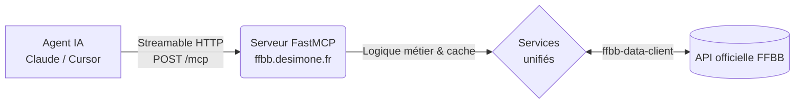

# 🏀 FFBB MCP Server

<p align="center">
  
</p>

<h3 align="center">Le pont de référence entre l’intelligence artificielle et le basket français.</h3>

<p align="center">
  Statistiques officielles FFBB, calendriers, classements et scores en direct, optimisés pour les LLM via le Model Context Protocol (MCP).
  <br /><br />
  🌐 <b><a href="https://ffbb.desimone.fr">Visiter la page d’accueil</a></b>
  · 🧩 <b><a href="https://github.com/nickdesi/FFBB-MCP-Server/releases/latest">Installer l’extension VS Code</a></b>
</p>

<p align="center">
  
  
  <a href="https://smithery.ai/server/ffbb-mcp-server"></a>
  
  
</p>

<p align="center">
  <em>Dernière mise à jour : 3 mai 2026 • Propulsé par <a href="https://pypi.org/project/ffbb-data-client/">ffbb-data-client</a></em>
</p>

---

## 🌟 Présentation

Le serveur **FFBB MCP** est l’implémentation de référence pour exposer les données officielles du basket français (FFBB) via le Model Context Protocol (MCP).

Il permet aux assistants IA (Claude, Gemini, Cursor) de naviguer intelligemment dans tout l’écosystème du basket français : championnats nationaux, régionaux et départementaux, avec une compréhension métier avancée (désambiguïsation des noms de clubs, gestion des phases et des poules, etc.).

> **Instance publique canonique :**
> 👉 `https://ffbb.desimone.fr/mcp`
> Tous les clients IA doivent pointer vers cette URL. Transport : **Streamable HTTP** (spécification MCP 2025-11-25).
>
> **Endpoints publics complémentaires :**
> - Dashboard live : `https://ffbb.desimone.fr/dashboard`
> - Métriques JSON : `https://ffbb.desimone.fr/metrics.json`
> - Santé du service : `https://ffbb.desimone.fr/health`

---

## 🚀 Connecter votre assistant IA

L’URL de l’instance publique est prête à l’emploi. Voici comment l’intégrer :

### ⭐ Installation la plus simple : extension VS Code

Pour VS Code et GitHub Copilot en mode agent, le plus rapide est d’installer l’extension **FFBB Basketball MCP** depuis la dernière release GitHub :

1. Téléchargez le fichier `.vsix` depuis les [releases](https://github.com/nickdesi/FFBB-MCP-Server/releases/latest).
2. Dans VS Code : `Extensions` → `...` → `Install from VSIX...`.
3. Ouvrez Copilot Chat en **Agent mode** : les outils FFBB sont disponibles automatiquement.

L’extension configure directement le serveur public `https://ffbb.desimone.fr/mcp`. Aucun fichier JSON à modifier.

> Alternative sans extension : cliquez sur ce lien depuis VS Code pour ajouter le serveur MCP distant :
> [Installer FFBB MCP](vscode:mcp/install?%7B%22name%22%3A%22ffbb-mcp%22%2C%22type%22%3A%22http%22%2C%22url%22%3A%22https%3A%2F%2Fffbb.desimone.fr%2Fmcp%22%7D)

### Claude Desktop
Ajoutez ceci dans votre fichier `claude_desktop_config.json` :

```json
{
  "mcpServers": {
    "ffbb": {
      "httpUrl": "https://ffbb.desimone.fr/mcp"
    }
  }
}
```

### Cursor / VS Code (configuration manuelle)
Dans l’interface de gestion MCP de votre éditeur :

1. Type : `Streamable HTTP`
2. URL : `https://ffbb.desimone.fr/mcp`

Pour VS Code, préférez l’extension quand c’est possible : elle évite toute configuration manuelle.

---

## 🛠️ Outils disponibles

Optimisé pour l’efficacité des LLM, le serveur fournit 12 outils unifiés et puissants :

### 📊 Outils prêts pour les agents IA (recommandés)

| Outil | Description | Paramètres clés |
| ----- | ----------- | --------------- |
| ⚡ **`ffbb_bilan`** | Bilan complet d’une équipe de A à Z (toutes phases), classements et résultats en 1 seul appel. | `club_name`, `organisme_id`, `categorie`, `force_refresh` |
| ⚡ **`ffbb_team_summary`** | Résumé idéal pour agent : bilan, phase courante, dernier résultat et prochain match. | `club_name`, `organisme_id`, `categorie` |
| 📈 **`ffbb_bilan_saison`** | Bilan détaillé de saison pour une équipe précise, toutes phases confondues. | `organisme_id`, `categorie`, `numero_equipe`, `force_refresh` |
| 🏀 **`ffbb_last_result`** | Score et détails du tout dernier match joué par l’équipe. | `categorie`, `club_name`, `organisme_id`, `numero_equipe`, `force_refresh` |
| 🗓️ **`ffbb_next_match`** | Détails du prochain match officiel (adversaire, date, salle si disponible). | `categorie`, `club_name`, `organisme_id`, `numero_equipe`, `force_refresh` |

### 🔍 Exploration, données brutes et diagnostics

| Outil | Description | Paramètres clés |
| ----- | ----------- | --------------- |
| `ffbb_search` | Moteur de recherche global (clubs, compétitions, salles, matchs, engagements, officiels, entraîneurs). | `query`, `type`, `limit`, `filter_by`, `sort` |
| `ffbb_resolve_team` | Résout les informations exactes d’une équipe depuis une chaîne (ex. `U11M1`). | `club_name`, `organisme_id`, `categorie` |
| `ffbb_get` | Accès direct aux ressources FFBB via un identifiant technique. | `id`, `type`, `force_refresh` |
| `ffbb_club` | Explore le calendrier complet d’un club, toutes ses équipes ou ses classements. | `action`, `club_name`, `organisme_id`, `filtre`, `numero_equipe`, `phase`, `force_refresh` |
| `ffbb_lives` | Récupère tous les matchs actuellement en direct en France. | *Aucun* |
| `ffbb_saisons` | Liste les saisons FFBB disponibles, avec option saison active uniquement. | `active_only` |
| `ffbb_version` | Retourne la version, le transport, les versions runtime et les TTL de cache. | *Aucun* |

---

## 🏗️ Architecture technique


```mermaid
flowchart LR
    A["Agent IA\nClaude / Cursor"] -->|"Streamable HTTP\nPOST /mcp"| B("Serveur FastMCP\nffbb.desimone.fr")
    B -->|"Logique métier & cache"| C{"Services\nunifiés"}
    C <-->|"ffbb-data-client"| D[("API officielle FFBB")]
```

- **Transport :** Streamable HTTP (spécification MCP 2025-11-25).
- **Réduction du contexte :** la couche de services consolide plusieurs micro-appels FFBB en réponses JSON concises, économisant massivement les tokens des LLM.
- **Cache multi-couche intelligent :** système de TTL dynamique adapté au calendrier (week-ends de matchs, intersaison) pour garantir une fraîcheur maximale (15 s en live) tout en optimisant les performances.
- **Rafraîchissement live automatique :** les scores en direct sont rafraîchis automatiquement le week-end, avec cache court dédié aux jours de match.
- **Observabilité intégrée :** dashboard live, métriques JSON et endpoint santé exposent l’état du service, l’usage du cache et les indicateurs de performance.
- **Déduplication concurrente :** les requêtes FFBB identiques déjà en cours sont mutualisées et le cache est revérifié sous verrou pour éviter les effets de stampede sous charge parallèle.
- **Métriques de latence précises :** les durées d’appels API utilisent des compteurs monotoniques haute résolution pour un suivi fiable des performances.
- **CI/CD renforcé :** les workflows sont sécurisés avec des SHA de commits pour renforcer la sécurité de la chaîne d’approvisionnement.

---

## 🎭 Intelligence embarquée (prompts)

Ce serveur expose des **prompts** natifs pour transmettre instantanément l’expertise métier basket à votre agent :

- 🎓 `expert_basket` : injecte les règles métier complexes de la FFBB (catégories, navigation multi-phases, usage des outils). **Fortement recommandé.**
- 📈 `bilan_equipe` : prompt guidé pour générer un rapport complet d’équipe.
- 🏙️ `analyser_match` / `prochain_match` : workflows en un clic pour analyser une rencontre ou préparer un prochain match.

---

## 🔧 FAQ et dépannage

- **L’IA ne trouve pas mon équipe locale :** indiquez toujours le nom complet du club (ex. `Vichy` plutôt que `JA Vichy` si c’est ambigu) et utilisez **`ffbb_search`**.
- **L’agent boucle sur des identifiants manquants :** rappelez-lui d’utiliser `ffbb_bilan` avec `club_name` pour déclencher la résolution interne.
- **Le club contient une apostrophe (ex. `Jeanne d'Arc`) :** ✅ support natif — les apostrophes typographiques (`’`, `‘`, `` ` ``) sont automatiquement normalisées.
- **Erreurs 404 :** vérifiez que vous utilisez bien l’endpoint canonique `https://ffbb.desimone.fr/mcp`.

---

## 👨‍💻 Contribution

Pour découvrir la documentation technique exhaustive et les guides de contribution :

1. [Référence complète des outils (🛠️)](docs/TOOLS_REFERENCE.md)
2. [Architecture détaillée (🏗️)](docs/ARCHITECTURE.md)
3. [Guide de contribution (👨‍💻)](CONTRIBUTING.md)

---
<p align="center">
  <i>Construit avec ❤️ pour la communauté basket. Ce projet non officiel n’est pas affilié à la Fédération Française de BasketBall.</i>
</p>
