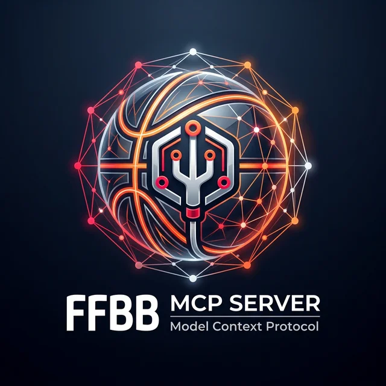
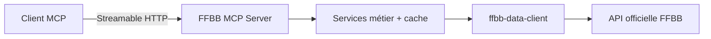

# 🏀 FFBB MCP Server

<p align="center">
  
</p>

<h3 align="center">Serveur MCP pour consulter les données officielles du basket français.</h3>

<p align="center">
  Calendriers, classements, bilans, résultats et scores live FFBB pour assistants IA compatibles MCP.
  <br /><br />
  🌐 <b><a href="https://ffbb.desimone.fr">Site</a></b>
  · 🧩 <b><a href="https://github.com/nickdesi/FFBB-MCP-Server/releases/latest">Extension VS Code</a></b>
  · 📚 <b><a href="https://ffbb.desimone.fr/docs/">Documentation</a></b>
</p>

<p align="center">
  
  
  <a href="https://smithery.ai/servers/nickdesi/mcpffbb"></a>
  
  
</p>

---

## Utiliser l'instance publique

Endpoint MCP public :

```text
https://ffbb.desimone.fr/mcp
```

Transport : **Streamable HTTP**.

Endpoints utiles :

- Dashboard : `https://ffbb.desimone.fr/dashboard`
- Métriques : `https://ffbb.desimone.fr/metrics.json`
- Santé : `https://ffbb.desimone.fr/health`

---

## Installation rapide

### VS Code / GitHub Copilot

Option recommandée : installer l’extension **FFBB Basketball MCP** depuis les [releases](https://github.com/nickdesi/FFBB-MCP-Server/releases/latest), puis ouvrir Copilot Chat en mode agent.

Alternative sans extension : [Installer FFBB MCP](vscode:mcp/install?%7B%22name%22%3A%22ffbb-mcp%22%2C%22type%22%3A%22http%22%2C%22url%22%3A%22https%3A%2F%2Fffbb.desimone.fr%2Fmcp%22%7D)

### Claude Desktop

Ajoutez le serveur dans `claude_desktop_config.json` :

```json
{
  "mcpServers": {
    "ffbb": {
      "httpUrl": "https://ffbb.desimone.fr/mcp"
    }
  }
}
```

### Cursor / autres clients MCP

Configurez un serveur MCP distant :

- Type : `Streamable HTTP`
- URL : `https://ffbb.desimone.fr/mcp`

---

## Outils principaux

| Outil | Usage |
| --- | --- |
| `ffbb_bilan` | Bilan complet d’une équipe, toutes phases confondues. |
| `ffbb_team_summary` | Résumé agent : bilan, classement courant, dernier résultat, prochain match. |
| `ffbb_bilan_saison` | Bilan détaillé d’une équipe précise avec `numero_equipe`. |
| `ffbb_last_result` | Dernier match joué. |
| `ffbb_next_match` | Prochain match. |
| `ffbb_club` | Calendrier complet, équipes ou classement d’un club. |
| `ffbb_search` | Recherche clubs, compétitions, salles, matchs, engagements. |
| `ffbb_get` | Accès technique à une ressource FFBB par identifiant. |
| `ffbb_lives` | Matchs en direct. |
| `ffbb_saisons` | Saisons disponibles. |
| `ffbb_version` | Version et diagnostic runtime. |

La référence complète est dans [`docs/TOOLS_REFERENCE.md`](docs/TOOLS_REFERENCE.md).

---

## Architecture en bref


```mermaid
flowchart LR
    A[Client MCP] -->|Streamable HTTP| B[FFBB MCP Server]
    B --> C[Services métier + cache]
    C --> D[ffbb-data-client]
    D --> E[API officielle FFBB]
```

Points clés :

- serveur Python 3.10+ basé sur `mcp[cli]`, `starlette` et `uvicorn` ;
- agrégation métier pour limiter le nombre d'appels et réduire le contexte LLM ;
- cache TTL adapté aux données live, calendriers et classements ;
- dashboard, métriques JSON et healthcheck intégrés.

Détails : [`docs/ARCHITECTURE.md`](docs/ARCHITECTURE.md) et [`docs/PERFORMANCE.md`](docs/PERFORMANCE.md).

---

## Développement local

```bash
uv sync --extra dev
uv run ruff format .
uv run ruff check --fix .
uv run mypy src
uv run pytest
```

Voir [`CONTRIBUTING.md`](CONTRIBUTING.md) pour les règles de contribution.

---

## Documentation

- [Exemples d’usage](docs/EXAMPLES.md)
- [Référence des outils](docs/TOOLS_REFERENCE.md)
- [Architecture](docs/ARCHITECTURE.md)
- [Performance et cache](docs/PERFORMANCE.md)
- [Déploiement Coolify](docs/COOLIFY_DEPLOYMENT.md)

---

<p align="center">
  <i>Projet non officiel, non affilié à la Fédération Française de BasketBall.</i>
</p>
