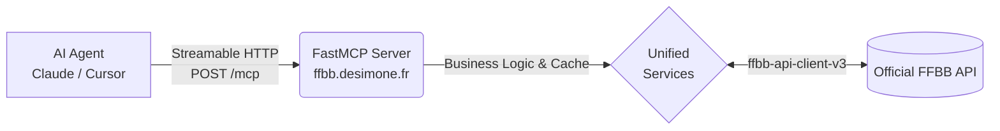

# 🏀 FFBB MCP Server

<p align="center">
  
</p>

<h3 align="center">The definitive bridge between Artificial Intelligence and French Basketball.</h3>

<p align="center">
  Official FFBB (French Basketball Federation) statistics, schedules, standings, and live scores, specifically optimized for LLMs via the Model Context Protocol (MCP).
  <br /><br />
  🌐 <b><a href="https://ffbb.desimone.fr">Visit the Landing Page</a></b>
</p>

<p align="center">
  
  
  <a href="https://smithery.ai/server/ffbb-mcp-server"></a>
  
  
</p>

<p align="center">
  <em>Last update: April 30, 2026 • Powered by <a href="https://pypi.org/project/ffbb-api-client-v3/">ffbb-api-client-v3</a></em>
</p>

---

## 🌟 Overview

The **FFBB MCP** server is the world's first and only reference implementation for exposing official French basketball data (FFBB) via the Model Context Protocol (MCP).

It enables AI assistants (Claude, Gemini, Cursor) to intelligently navigate the entire French basketball ecosystem: from national leagues to regional and departmental championships, with unmatched business logic understanding (club name disambiguation, phase/group management, etc.).

> **Canonical Public Instance:**
> 👉 `https://ffbb.desimone.fr/mcp`
> All AI clients should point to this URL. Transport: **Streamable HTTP** (MCP spec 2025-11-25).

---

## 🚀 Connect Your AI Assistant

The public instance URL is ready to use. Here is how to integrate it:

### Claude Desktop
Add this to your `claude_desktop_config.json`:

```json
{
  "mcpServers": {
    "ffbb": {
      "httpUrl": "https://ffbb.desimone.fr/mcp"
    }
  }
}
```

### Cursor / VS Code (MCP Extension)
In the editor's MCP management interface:

1. Type: `Streamable HTTP`
2. URL: `https://ffbb.desimone.fr/mcp`

---

## 🛠️ Toolset

Optimized for LLM efficiency, the server provides 11 unified and powerful tools:

### 📊 Agent-Ready Tools (Recommended)

| Tool | Description | Key Parameters |
| ----- | ----------- | --------------- |
| ⚡ **`ffbb_bilan`** | Complete A-to-Z team record (all phases), standings & results in 1 call. | `club_name`, `categorie`, `force_refresh` |
| ⚡ **`ffbb_team_summary`** | The perfect agent summary: record, current phase, last result, and next match. | `club_name`, `categorie` |
| 🏀 **`ffbb_last_result`** | Score and details of the very last match played by the team. | `categorie`, `club_name`, `force_refresh` |
| 🗓️ **`ffbb_next_match`** | Upcoming official match details (opponent, date, venue). | `categorie`, `club_name`, `force_refresh` |

### 🔍 Exploration & Raw Data Tools

| Tool | Description | Key Parameters |
| ----- | ----------- | --------------- |
| `ffbb_search` | Global search engine (clubs, competitions, venues, matches, registrations). | `query`, `type`, `limit` |
| `ffbb_resolve_team` | Resolves exact team info/ID from a string (e.g., "U11M1"). | `club_name`, `categorie` |
| `ffbb_get` | Direct access to full standings and matches by technical ID. | `id`, `type`, `force_refresh` |
| `ffbb_club` | Explore a club's full schedule, all teams, or all standings. | `action`, `club_name`, `force_refresh` |
| `ffbb_lives` | Fetch all matches currently playing live in France. | *None* |

---

## 🏗️ Technical Architecture


```mermaid
flowchart LR
    A["AI Agent\nClaude / Cursor"] -->|"Streamable HTTP\nPOST /mcp"| B("FastMCP Server\nffbb.desimone.fr")
    B -->|"Business Logic & Cache"| C{"Unified\nServices"}
    C <-->|"ffbb-api-client-v3"| D[("Official FFBB API")]
```

- **Transport:** Streamable HTTP (MCP spec 2025-11-25).
- **Context Reduction:** The Service Layer consolidates multiple FFBB micro-calls into concise JSON responses, saving massive LLM tokens.
- **Intelligent Multi-layer Cache:** Dynamic TTL system adjusting to the calendar (live weekends vs off-season) to ensure maximum freshness (15s live) while optimizing performance.
- **Hardened CI/CD:** Workflows are secured using commit SHAs for maximum supply chain security.

---

## 🎭 Embedded Intelligence (Prompts)

This server exposes native **Prompts** to instantly give business expertise to your agent:

- 🎓 `expert_basket`: Injects complex FFBB business rules (categories, multi-phase navigation, tool usage). **Highly recommended.**
- 📈 `bilan_equipe`: Guided prompt for generating a comprehensive team report.
- 🏙️ `analyser_match` / `prochain_match`: 1-click workflows to dissect a specific encounter.

---

## 🔧 FAQ & Troubleshooting

- **AI cannot find my local team:** Always provide the full club name (e.g., `Vichy` instead of `JA Vichy` if ambiguous) and use **`ffbb_search`**.
- **Agent loops on missing IDs:** Remind the agent to use `ffbb_bilan` with `club_name` to trigger internal resolution.
- ** club contains an apostrophe (e.g., `Jeanne d'Arc`):** ✅ Native support — typographic apostrophes (`’`, `‘`, `` ` ``) are automatically normalized.
- **404 Errors:** Ensure you are using the canonical endpoint `https://ffbb.desimone.fr/mcp`.

---

## 👨‍💻 Contribution

To discover exhaustive technical documentation and contribution guides:
1. [Full Tools Reference (🛠️)](docs/TOOLS_REFERENCE.md)
2. [Detailed Architecture (🏗️)](docs/ARCHITECTURE.md)
3. [Contribution Guide (👨‍💻)](CONTRIBUTING.md)

---
<p align="center">
  <i>Built with ❤️ for the basketball community. This unofficial project is not affiliated with the Fédération Française de BasketBall.</i>
</p>
