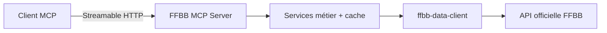

<div align="center">

# 🏀 FFBB MCP Server

**Le basket français officiel, directement dans vos assistants IA.**

Serveur [MCP](https://modelcontextprotocol.io) pour consulter calendriers, classements, bilans, résultats et scores live de la FFBB.

[🌐 Site](https://ffbb.desimone.fr) ·
[🧩 Extension VS Code](https://github.com/nickdesi/FFBB-MCP-Server/releases/latest) ·
[📚 Documentation](https://ffbb.desimone.fr/docs/) ·
[💬 Support](SUPPORT.md)

<br />

[](https://www.python.org)
[](https://github.com/nickdesi/FFBB-MCP-Server/releases/latest)
[](https://github.com/nickdesi/FFBB-MCP-Server/releases/latest)
[](https://github.com/nickdesi/FFBB-MCP-Server/actions/workflows/ci.yml)
[](LICENSE)
[](https://modelcontextprotocol.io)
[](Dockerfile)
[](SECURITY.md)
[](https://github.com/nickdesi/FFBB-MCP-Server/stargazers)
[](https://github.com/nickdesi/FFBB-MCP-Server/commits/main)
[](https://github.com/nickdesi/FFBB-MCP-Server/issues)
[](https://github.com/nickdesi/FFBB-MCP-Server/pulls)
[](https://smithery.ai/servers/nickdesi/mcpffbb)
[](https://glama.ai/mcp/servers/nickdesi/FFBB-MCP-Server)

</div>

---

## ⚡ Démarrage express (< 2 min)

> [!TIP]
> **Aucune installation requise** : le serveur est hébergé publiquement. Ajoutez simplement l'endpoint MCP à votre client :

```text
https://ffbb.desimone.fr/mcp
```

Puis posez vos questions en langage naturel :

> _« Quel est le prochain match des U15 de mon club ? »_
> _« Donne-moi le classement de la poule et le dernier résultat. »_
> _« Y a-t-il des matchs en direct ce soir ? »_

👉 Voir la section [Installation](#-installation) pour brancher l'endpoint sur VS Code, Claude, Cursor, etc.

---

## ✨ Fonctionnalités

- 🗓️ **Calendriers & résultats** — matchs passés et à venir, par club ou par équipe.
- 🏆 **Classements** — poules complètes avec points, différentiel et forme.
- 📊 **Bilans agrégés** — toutes phases confondues en un seul appel.
- 🔴 **Scores live** — matchs en cours, mis à jour toutes les 30 s.
- 🔎 **Recherche universelle** — clubs, compétitions, salles, engagements.
- 🚀 **Optimisé pour les LLM** — réponses agrégées et cache TTL pour réduire le contexte et le nombre d'appels.

---

## 🚀 Installation

### VS Code / GitHub Copilot

**Option recommandée** — installer l'extension **FFBB Basketball MCP** depuis les [releases](https://github.com/nickdesi/FFBB-MCP-Server/releases/latest), puis ouvrir Copilot Chat en mode agent.

**Alternative sans extension** — [➕ Installer FFBB MCP en un clic](vscode:mcp/install?%7B%22name%22%3A%22ffbb-mcp%22%2C%22type%22%3A%22http%22%2C%22url%22%3A%22https%3A%2F%2Fffbb.desimone.fr%2Fmcp%22%7D)

### Claude Desktop

<details>
<summary><b>Option A — Via l'interface de Claude</b> (recommandé, sans prérequis)</summary>

<br />

1. Ouvrez les **Paramètres** de Claude, puis **Connecteurs** (ou **Plugins**).
2. Cliquez sur **Ajouter un connecteur personnalisé**.
3. Renseignez l'URL publique `https://ffbb.desimone.fr/mcp` et validez.

</details>

<details>
<summary><b>Option B — Via <code>claude_desktop_config.json</code></b> (nécessite Node.js)</summary>

<br />

Claude Desktop n'accepte que le transport `stdio` local : on utilise donc le bridge SSE officiel via `npx`.

> [!WARNING]
> **Prérequis : Node.js** (inclut `npm` et `npx`). Sans Node.js, privilégiez l'**Option A**.

```json
{
  "mcpServers": {
    "ffbb": {
      "command": "npx",
      "args": ["-y", "@modelcontextprotocol/client-sse", "https://ffbb.desimone.fr/mcp"]
    }
  }
}
```

</details>

### Cursor / autres clients MCP

Configurez un serveur MCP distant :

| Champ | Valeur |
| --- | --- |
| Type | `Streamable HTTP` |
| URL | `https://ffbb.desimone.fr/mcp` |

### Google Antigravity

Configurez directement l'URL distante dans `mcp_config.json` via la directive native `serverUrl` :

```json
{
  "mcpServers": {
    "ffbb_mcp": {
      "serverUrl": "https://ffbb.desimone.fr/mcp"
    }
  }
}
```

---

## 🧰 Outils principaux

| Outil | Usage |
| --- | --- |
| `ffbb_version` | Informations de version et configuration runtime du serveur FFBB MCP. |
| `ffbb_search` | Recherche FFBB — clubs, compétitions, matchs, salles, tournois, etc. |
| `ffbb_bilan` | Bilan complet d'une équipe toutes phases confondues en UN seul appel. |
| `ffbb_get` | Recupere une ressource FFBB par identifiant. |
| `ffbb_club` | Outils agreges autour d'un club (calendrier, equipes, classement). |
| `ffbb_lives` | Matchs en cours (scores live, cache 30s). Retourne [] si aucun match. |
| `ffbb_saisons` | Liste des saisons FFBB. active_only=True pour la saison en cours uniquement. |
| `ffbb_resolve_team` | Identifie une equipe unique (Pivot central). |
| `ffbb_team_summary` | Résumé complet et agent-friendly pour une équipe. |
| `ffbb_last_result` | Dernier résultat d'une équipe précise. |
| `ffbb_next_match` | Prochain match à jouer pour une équipe précise. |
| `ffbb_bilan_saison` | Bilan détaillé de la saison pour une équipe précise (toutes phases). |

> [!NOTE]
> Référence complète des paramètres : [`docs/TOOLS_REFERENCE.md`](docs/TOOLS_REFERENCE.md).

---

## 🌐 Instance publique

Endpoint MCP (transport **Streamable HTTP**) :

```text
https://ffbb.desimone.fr/mcp
```

| Endpoint | URL |
| --- | --- |
| 📊 Dashboard | `https://ffbb.desimone.fr/dashboard` |
| 📈 Métriques | `https://ffbb.desimone.fr/metrics.json` |
| ❤️ Santé | `https://ffbb.desimone.fr/health` |

---

## 🏗️ Architecture


```mermaid
flowchart LR
    A[Client MCP] -->|Streamable HTTP| B[FFBB MCP Server]
    B --> C[Services métier + cache]
    C --> D[ffbb-data-client]
    D --> E[API officielle FFBB]
```

Points clés :

- serveur Python 3.14+ basé sur `mcp[cli]`, `starlette` et `uvicorn` ;
- agrégation métier pour limiter le nombre d'appels et réduire le contexte LLM ;
- cache TTL adapté aux données live, calendriers et classements ;
- dashboard, métriques JSON et healthcheck intégrés.

Détails : [`docs/ARCHITECTURE.md`](docs/ARCHITECTURE.md) et [`docs/PERFORMANCE.md`](docs/PERFORMANCE.md).

---

## 💻 Développement local

```bash
uv sync --extra dev       # installer les dépendances
uv run ruff format .      # formater
uv run ruff check --fix . # linter
uv run mypy src           # vérifier les types
uv run pytest             # lancer les tests
```

Voir [`CONTRIBUTING.md`](CONTRIBUTING.md) pour les règles de contribution.

---

## 🧪 Tests

```bash
uv run pytest             # tests unitaires + couverture
uv run pytest tests/      # ciblé
```

Le pipeline CI (`.github/workflows/ci.yml`) exécute ruff, mypy, pytest et le contrôle de couverture à chaque push/PR.

---

## 📚 Documentation

- [Exemples d’usage](docs/EXAMPLES.md)
- [Référence des outils](docs/TOOLS_REFERENCE.md)
- [Architecture](docs/ARCHITECTURE.md)
- [Performance et cache](docs/PERFORMANCE.md)
- [Déploiement Coolify](docs/COOLIFY_DEPLOYMENT.md)

---

## 🤝 Communauté

- [Contribuer](CONTRIBUTING.md)
- [Code de conduite](CODE_OF_CONDUCT.md)
- [Support](SUPPORT.md)
- [Sécurité](SECURITY.md)

---

## ❓ Dépannage

| Symptôme | Cause probable | Solution |
| --- | --- | --- |
| `Missing session ID` / `deadline exceeded` | Wrapper `mcp-remote` ou mauvais transport | Utiliser `serverUrl` natif dans `mcp_config.json` (voir [Google Antigravity](#google-antigravity)) |
| Claude Desktop refuse l'URL `http` | Claude Desktop impose `stdio` | Utiliser le bridge `@modelcontextprotocol/client-sse` via `npx` (voir [Claude Desktop](#claude-desktop)) |
| Données live obsolètes | Cache TTL | Attendre le rafraîchissement (≤ 30 s) ou interroger l'endpoint `/health` |

---

<p align="center">
  <i>Projet non officiel, non affilié à la Fédération Française de BasketBall.</i>
</p>
