# 🏀 FFBB MCP Server

[](https://github.com/nickdesi/FFBB-MCP-Server/actions/workflows/ci.yml)
[](https://www.python.org)
[](https://modelcontextprotocol.io)
[](https://www.ffbb.com)
[](LICENSE)

Ce serveur MCP expose les données de la **Fédération Française de Basketball (FFBB)** pour les agents IA (Claude, IDEs). Il utilise la bibliothèque `ffbb-api-client-v3` pour un accès performant et sécurisé.

---

## 🏗️ Architecture

Le serveur agit comme une interface normalisée entre les agents IA et l'API FFBB, gérant l'authentification et offrant un filtrage sémantique intelligent.

```mermaid
graph TD
    User([Utilisateur]) --> Agent[Assistant IA / Agent]
    Agent -->|Requête MCP| Server[FFBB MCP Server]
    Server -->|Token Auto| Auth[Token Manager]
    Server -->|Fetch| API[FFBB Public API]
    API -.->|Data JSON| Server
    Server -->|Réponse Structurée| Agent
    Agent -->|Réponse Naturelle| User
```



---

## ✨ Fonctionnalités

- 📡 **Données en Temps Réel** : Matchs en direct, scores, calendrier.
- 🔍 **Recherche Puissante** : Recherche globale ou ciblée (clubs, compétitions, salles).
- 📂 **Ressources Directes** : Accès stable aux saisons, poules et organismes via URIs (`ffbb://competition/{id}`, `ffbb://poule/{id}`).
- 💡 **Prompts Intelligents** : Workflows pré-configurés (`analyser_match`, `trouver_club`, `prochain_match`, `classement_poule`).
- 🔑 **Auth Zéro-Config** : Gestion automatique des jetons API et Meilisearch avec rafraîchissement proactif.

## 🛠 Outils disponibles

| Catégorie | Outil | Description |
|-----------|-------|-------------|
| **Direct** | `ffbb_get_lives` | Matchs en cours (Live) |
| | `ffbb_get_saisons` | Liste des saisons |
| **Clubs** | `ffbb_get_organisme` | Détails complets d'un club |
| | `ffbb_equipes_club` | Liste des équipes engagées |
| | `ffbb_calendrier_club`| Matchs (passés/futurs) d'un club |
| **Compét.**| `ffbb_get_competition`| Détails d'un championnat |
| | `ffbb_get_poule` | Rencontres et classement complet |
| | `ffbb_get_classement`| Classement d'une poule seul (léger) |
| **Recherche**| `ffbb_multi_search` | Recherche globale multi-critères |
| | `ffbb_search_*` | Recherche ciblée (salles, terrains...) |

> Retrouvez l'aide détaillée de chaque outil dans [docs/TOOLS_REFERENCE.md](docs/TOOLS_REFERENCE.md).

---

## 🚀 Installation & Lancement

```bash
# 1. Cloner le repo
git clone https://github.com/nickdesi/FFBB-MCP-Server.git
cd FFBB-MCP-Server

# 2. Setup de l'environnement
python -m venv .venv
source .venv/bin/activate
pip install -e "."

# 3. Tester en local (MCP Inspector)
npx @modelcontextprotocol/inspector python -m ffbb_mcp
```

---

## ⚙️ Intégration IDE & Desktop

### 🪐 Google Antigravity (Gemini Code Assist / CLI)

Éditez votre fichier `~/.gemini/settings.json` :

```json
{
  "mcpServers": {
    "ffbb_mcp": {
      "command": "python",
      "args": ["-m", "ffbb_mcp"],
      "cwd": "/votre/chemin/FFBB-MCP-Server"
    }
  }
}
```

### 💻 VS Code (Roo Code / Cline)

Installez l'extension et configurez la source :

```json
{
  "mcpServers": {
    "ffbb_mcp": {
      "command": "/votre/chemin/.venv/bin/python",
      "args": ["-m", "ffbb_mcp"],
      "cwd": "/votre/chemin/FFBB-MCP-Server"
    }
  }
}
```

### 🧠 Claude Desktop

Éditez `~/Library/Application Support/Claude/claude_desktop_config.json` :

```json
{
  "mcpServers": {
    "ffbb_mcp": {
      "command": "/votre/chemin/.venv/bin/python",
      "args": ["-m", "ffbb_mcp"],
      "cwd": "/votre/chemin/FFBB-MCP-Server"
    }
  }
}
```

---

## 🚀 Déploiement distant (Coolify)

Idéal pour exposer le serveur sur une IP publique pour des Agents (ou Cursor distant).

1. Sur **Coolify**, ajoutez un nouveau service basé sur un **Dépôt Git Public / Privé** pointant vers ce repo.
2. Choisissez le **Build Pack Docker** (le fichier `Dockerfile` mettra tout en place).
3. Définissez les variables d'environnement optionnelles pour votre URL Coolify :
   - `MCP_MODE=sse` *(obligatoire, configuré par défaut dans le Dockerfile)*
   - `PORT=9123` *(obligatoire pour matcher le port exposé)*
4. Déployez ! Il sera en ligne sur `https://votre-domaine.fr/mcp`.

---

## 🤖 Guide de Survie pour Agents IA (Best Practices)

Pour les développeurs d'agents, ce serveur a été optimisé pour une utilisation sémantique :

1. **Fiabilité Max** : Ne tentez pas de deviner les IDs. Utilisez `ffbb_search_organismes` pour trouver le club, puis listez les équipes via `ffbb_equipes_club`.
2. **Filtrage Intelligent** : Les agents doivent utiliser les indices de texte (ex: "Equipe 2", "U11M") pour filtrer les résultats d'engagement avant d'appeler `ffbb_get_poule`.
3. **Classement Rapide** : Pour obtenir uniquement le classement, utilisez `ffbb_get_classement` (plus léger que `ffbb_get_poule`).
4. **Gestion des Alias** : Le serveur supporte les recherches par acronymes si l'agent est capable de faire le lien (ex: SCBA -> Stade Clermontois).

---

## 📚 Source & Crédits

- **Données** : Fédération Française de Basketball.
- **Core Library** : [`ffbb-api-client-v3`](https://github.com/nickdesi/FFBBApiClientV3).
- **Maintenance** : Nicolas De Simone.

---

*Fait avec ❤️ par et pour les passionnés de basket.*
