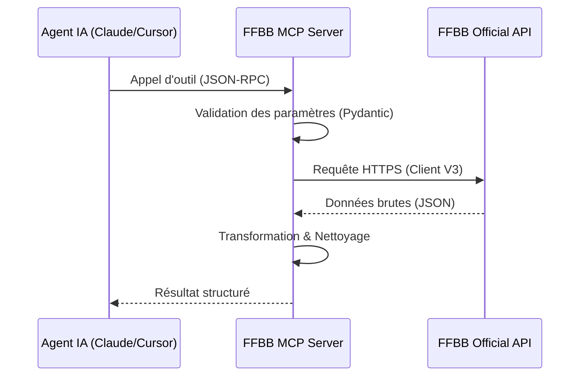

# 🏗️ Architecture Technique

Ce document détaille le fonctionnement interne du serveur **FFBB MCP**.

## 🧩 Composants Principaux

### 1. FastMCP (Core)

Nous utilisons le framework `mcp.server.fastmcp` pour simplifier la définition des outils, prompts et ressources. Il gère automatiquement la sérialisation JSON-RPC et la validation des types via **Pydantic**.

### 2. Transport Layer

Le serveur supporte deux modes d'exposition :

- **Stdio** : Utilisé pour l'exécution locale (via `uvx`). Communication via stdin/stdout.
- **SSE (Streamable HTTP)** : Utilisé pour le déploiement cloud (Cloudify). Communication via des événements HTTP (Server-Sent Events) exploités par FastAPI.

### 3. Service Layer (`services.py`)

Cette couche fait le pont entre les outils MCP et le client API FFBB. Elle gère :

- La transformation des données brutes en JSON structuré.
- La gestion des erreurs d'API.
- Le filtrage et le tri des résultats.

## 🔄 Flux de Données

## 🌐 Déploiement SSE

En mode `SSE`, le serveur utilise `uvicorn` pour lancer une application FastAPI.
Nous utilisons `mcp.streamable_http_app()` qui permet d'exposer le serveur sur un endpoint unique (ex: `/mcp`) plutôt que de séparer `/sse` et `/messages`. Un endpoint de monitoring `/health` est également exposé par l'application FastAPI indépendamment du router MCP.

### Sécurité

La configuration actuelle utilise `allowed_origins=["*"]` pour faciliter l'intégration avec divers clients web, mais peut être restreinte via les variables d'environnement si nécessaire.

## 🖥️ Clients Supportés

Le serveur **FFBB MCP** est conçu pour être compatible avec les principaux clients du marché :

- **Google Antigravity** : Intégration native via SSE. La configuration se fait dans `mcp_config.json`.
- **VS Code** : Utilisation recommandée de l'extension **MCP for VS Code** via le transport SSE.
- **Claude Desktop** : Support complet via Stdio (local) ou SSE (remote).
- **Cursor / AnythingLLM** : Compatibilité assurée via les protocoles standards MCP.
