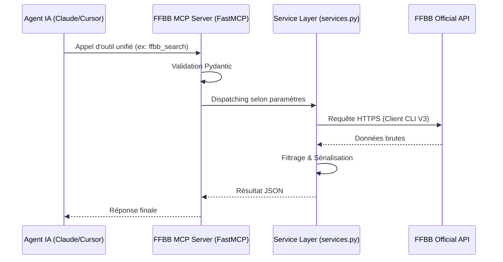

# 🏗️ Architecture Technique

Ce document détaille le fonctionnement interne du serveur **FFBB MCP**.

## 🧩 Composants Principaux

### 1. FastMCP (Core)

Nous utilisons le framework `mcp.server.fastmcp` pour simplifier la définition des outils, prompts et ressources. Il gère automatiquement la sérialisation JSON-RPC et la validation des types via **Pydantic**.

### 2. Transport Layer

Le serveur supporte deux modes d'exposition :

- **Stdio** : Utilisé pour l'exécution locale (via `uvx`). Communication via stdin/stdout.
- **SSE (Streamable HTTP)** : Utilisé pour le déploiement cloud (Cloudify). Communication via des événements HTTP (Server-Sent Events) exploités par FastAPI.

### 3. Service Layer (`services.py`)

Cette couche fait le pont entre les outils MCP et le client API FFBB. Elle implémente les patterns suivants :

- **Unification des entrées** : Centralise les requêtes disparates vers des points d'entrée uniques pour simplifier l'utilisation par les LLMs.
- **Normalisation des données** : Transforme les modèles Pydantic complexes de l'API FFBB en structures JSON légères et exploitables.
- **Gestion du Cache** : Utilise des mécanismes de mise en cache pour réduire la latence sur les requêtes fréquentes (recherche, classements).

## 🏗️ Consolidation des Outils (Refactoring)

Récemment, le serveur a migré de 15 outils atomiques vers **5 outils unifiés**. Cette approche améliore considérablement les performances des agents IA :

1. **Réduction du Context Window** : Moins de définitions d'outils à charger pour le LLM.
2. **Logique de Dispatch Interne** : Les outils comme `ffbb_search` utilisent une logique de routing interne pour appeler le bon service de recherche selon les paramètres.
3. **Discovery Facile** : Un point d'entrée unique (`ffbb_search`) permet à l'agent de trouver des IDs sans connaître l'arborescence complète de l'API.

## 🔄 Flux de Données

## 🌐 Déploiement SSE

En mode `SSE`, le serveur utilise `uvicorn` pour lancer une application FastAPI.
Nous utilisons `mcp.streamable_http_app()` qui permet d'exposer le serveur sur un endpoint unique (ex: `/mcp`) plutôt que de séparer `/sse` et `/messages`. Un endpoint de monitoring `/health` est également exposé par l'application FastAPI indépendamment du router MCP.

## 🖥️ Clients Supportés

Le serveur **FFBB MCP** est compatible avec tout client respectant le protocole MCP :

- **Google Antigravity** : Intégration native via SSE.
- **Claude Desktop / Claude Code** : Support via Stdio (local) ou SSE (distant).
- **Cursor / IDEs** : Compatibilité via le plugin MCP.
