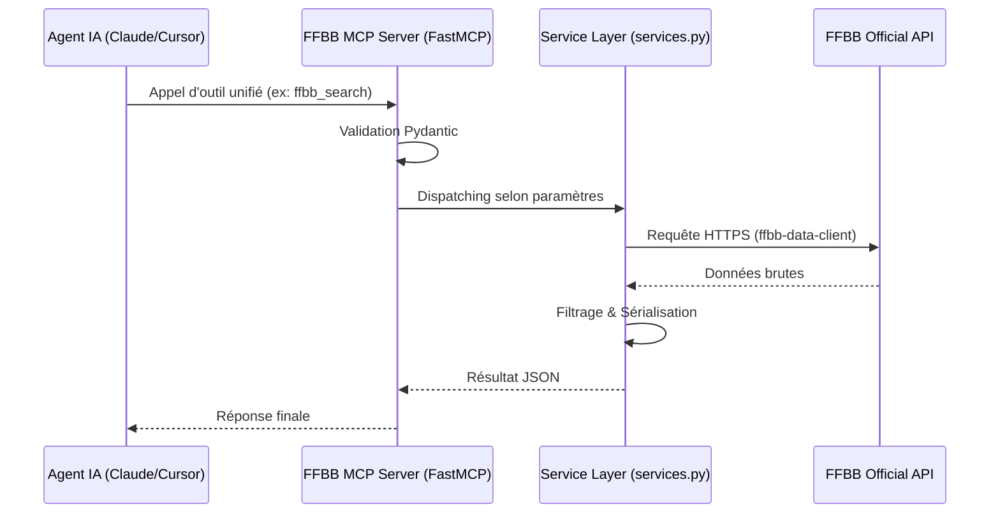

# 🏗️ Architecture Technique

Ce document détaille le fonctionnement interne du serveur **FFBB MCP**.

## 🧩 Composants Principaux

### 1. FastMCP (Core)

Nous utilisons le framework `mcp.server.fastmcp` pour simplifier la définition des outils, prompts et ressources. Il gère automatiquement la sérialisation JSON-RPC et la validation des types via **Pydantic**.

### 2. Transport Layer

Le serveur supporte deux modes d'exposition :

- **Stdio** : Utilisé pour l'exécution locale (via `uvx`). Communication via stdin/stdout.
- **Streamable HTTP** : Utilisé pour le déploiement cloud (Coolify). Endpoint unique `/mcp` acceptant `POST` (JSON-RPC) et `GET` (stream serveur→client optionnel). Transport configuré via `MCP_MODE=http` ou `MCP_MODE=streamable-http`.

### 3. Service Layer (`services.py`)

Cette couche fait le pont entre les outils MCP et le client API FFBB. Elle implémente les patterns suivants :

- **Accès FFBB** : Délègue les appels réseau au package `ffbb-data-client` (`>=2.0.0,<3.0.0`) au lieu de réimplémenter les endpoints FFBB.
- **Unification des entrées** : Centralise les requêtes disparates vers des points d'entrée uniques pour simplifier l'utilisation par les LLMs.
- **Normalisation des données** : Transforme les modèles Pydantic complexes de l'API FFBB en structures JSON légères et exploitables.
- **Gestion du Cache** : Utilise des mécanismes de mise en cache pour réduire la latence sur les requêtes fréquentes (recherche, classements).

## 🏗️ Surface MCP actuelle

Le serveur expose **12 outils MCP** en lecture seule. Les quatre outils généralistes (`ffbb_search`, `ffbb_get`, `ffbb_club`, `ffbb_bilan`) couvrent les workflows les plus fréquents, et les outils spécialisés réduisent les appels nécessaires pour les questions courtes.

| Famille | Outils | Usage |
| --- | --- | --- |
| Diagnostic | `ffbb_version` | Version, transport et TTL de cache runtime. |
| Recherche & lecture | `ffbb_search`, `ffbb_get` | Recherche multi-index puis chargement par identifiant. |
| Club & équipe | `ffbb_club`, `ffbb_resolve_team`, `ffbb_team_summary` | Navigation club → équipes → poules, résumé agent-friendly. |
| Résultats | `ffbb_bilan`, `ffbb_last_result`, `ffbb_next_match`, `ffbb_bilan_saison` | Bilan saison, dernier résultat et prochain match. |
| Temps réel | `ffbb_lives`, `ffbb_saisons` | Scores live et saisons disponibles. |

Ce découpage garde des points d'entrée simples pour les LLM tout en évitant un outil unique trop complexe.

## 🔄 Flux de Données

```mermaid
sequenceDiagram
    participant LLM as Agent IA (Claude/Cursor)
    participant MCP as FFBB MCP Server (FastMCP)
    participant Service as Service Layer (services.py)
    participant API as FFBB Official API

    LLM->>MCP: Appel d'outil unifié (ex: ffbb_search)
    MCP->>MCP: Validation Pydantic
    MCP->>Service: Dispatching selon paramètres
    Service->>API: Requête HTTPS (ffbb-data-client)
    API-->>Service: Données brutes
    Service->>Service: Filtrage & Sérialisation
    Service-->>MCP: Résultat JSON
    MCP-->>LLM: Réponse finale
```

## 🌐 Déploiement Streamable HTTP

En mode `http` (ou `streamable-http`), le serveur configure FastMCP pour exposer le transport **Streamable HTTP** (spec 2025-11-25) sur l'endpoint unique `/mcp` :

- `POST /mcp` → JSON-RPC (initialize, tools/call…) — **obligatoire**
- `GET /mcp` → Server-to-client stream — optionnel

D'autres routes annexes sont exposées par l'application Starlette/FastMCP :

| Route | Rôle |
| --- | --- |
| `/health` | Healthcheck JSON enrichi pour Coolify/monitoring. |
| `/metrics` | Métriques Prometheus texte. |
| `/metrics.json` | Snapshot JSON lisible par dashboard ou supervision légère. |
| `/dashboard` | Dashboard HTML de monitoring. |
| `/docs`, `/docs/`, `/docs/{path:path}` | Documentation statique hébergée. |
| `/` | Page d'accueil publique. |
| `/logo.webp`, `/favicon.ico`, `/css/style.css`, `/robots.txt`, `/sitemap.xml` | Assets et SEO du site public. |

## 🖥️ Clients Supportés

Le serveur **FFBB MCP** est compatible avec tout client respectant le protocole MCP :

- **Google Antigravity** : Intégration native via Streamable HTTP.
- **Claude Desktop / Claude Code** : Support via Stdio (local) ou Streamable HTTP (distant).
- **Cursor / IDEs** : Compatibilité via le plugin MCP.

## ⚡ Stratégie de Performance

Le serveur FFBB MCP est conçu pour minimiser les appels à l'API FFBB
quotaisée tout en gardant une fraîcheur acceptable pour les usages les
plus fréquents. Trois mécanismes complémentaires se combinent :

### 1. Cache TTL différencié (`services/common.py` + `cache_strategy.py`)

Chaque type de donnée a une fenêtre de fraîcheur adaptée à sa
fréquence d'évolution :

| Type | TTL par défaut | Override |
| :--- | :---: | :--- |
| `lives` | 30 s | `FFBB_CACHE_TTL_LIVES` |
| `search` | 300 s | `FFBB_CACHE_TTL_SEARCH` |
| `calendrier` | 1800 s | `FFBB_CACHE_TTL_CALENDRIER` |
| `poule` / `bilan` | 1800 s | `FFBB_CACHE_TTL_POULE` |
| `salle` | 86400 s | `FFBB_CACHE_TTL_SALLE` |
| `organisme` / `competition` | 86400 s | `FFBB_CACHE_TTL_DETAIL` |
| `resolve_club` | 3600 s | `FFBB_CACHE_TTL_RESOLVE_CLUB` |

Les outils exposés proposent tous un paramètre `force_refresh=True`
qui contourne le cache (utile les jours de match, ou pour vérifier
un score frais via `ffbb_lives`).

### 2. Sémaphore global de concurrence (`_MAX_CONCURRENT_FFBB`)

Un `asyncio.Semaphore(8)` plafonne les appels parallèles à l'API FFBB
pour éviter d'être rate-limité. Réglable via `MAX_CONCURRENT_FFBB=N`
(valeur sûre d'après tests : 4–12).

### 3. Inflight deduplication (`_dedupe_inflight*`)

Quand plusieurs requêtes arrivent simultanément avec la même clé
(par exemple deux agents qui résolvent le même club en parallèle), le
premier crée une `asyncio.Task` partagée et tous les appelants
attendent la même promesse. Le résultat est mis en cache à la fin. Cela
évite N requêtes pour une même donnée chaude.

### 4. Token refresh proactif (`client.py`)

Le token FFBB expire à ~30 min. Il est rafraîchi en tâche de fond
à 25 min (marge de sécurité), ce qui évite une latence visible au
moment de la rotation de token.

### Notes

- La complexité cyclomatique est surveillée via `radon cc src/` (job
  CI). Le rapport est informatif par défaut — un seuil strict peut
  être activé avec `-n C`.
- Les endpoints `POST /cache/warmup` et `GET /cache/ttl` permettent
  respectivement de préchauffer le cache et d'inspecter les TTL en
  runtime. Le préchauffage est borné (`FFBB_WARMUP_MAX_ORGANISMES`,
  body ≤ 64 Ko) et peut être authentifié (`FFBB_WARMUP_API_KEY`,
  Bearer) pour limiter l'exposition en mode HTTP.
