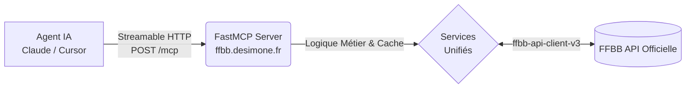

# Pourquoi FFBB MCP ?

Le serveur **FFBB MCP** est la **première et unique référence mondiale** permettant d'exposer les données officielles du basketball français (FFBB) au protocole MCP (Model Context Protocol).

## 🏀 Un pont vers le Basketball français

Il permet aux assistants IA (Claude, Gemini, Cursor) de naviguer intelligemment dans tout l'écosystème du basket français : des ligues nationales aux championnats régionaux et départementaux.

### Points forts
- **Compréhension métier** : Résolution intelligente des noms de clubs ambigus.
- **Gestion des phases** : Navigation fluide entre les phases de poules et les phases finales.
- **Performance** : Consolidation de micro-appels FFBB en réponses JSON concises pour économiser vos tokens.
- **Temps réel** : Scores en direct et rafraîchissement intelligent selon le calendrier.

## 🏗️ Architecture

- **Transport** : Streamable HTTP (spec MCP 2025-11-25).
- **Cache Intelligent** : TTL dynamique s'adaptant au calendrier (mercredi/weekend live).
- **Auto-résolution** : Identification automatique des équipes et des poules.
