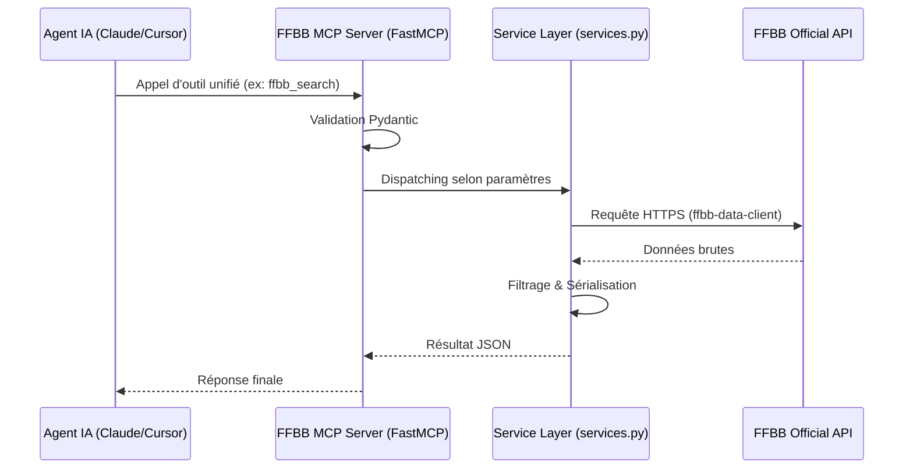

# 🏗️ Architecture Technique

Ce document détaille le fonctionnement interne du serveur **FFBB MCP**.

## 🧩 Composants Principaux

### 1. FastMCP (Core)

Nous utilisons le framework `mcp.server.fastmcp` pour simplifier la définition des outils, prompts et ressources. Il gère automatiquement la sérialisation JSON-RPC et la validation des types via **Pydantic**.

### 2. Transport Layer

Le serveur supporte deux modes d'exposition :

- **Stdio** : Utilisé pour l'exécution locale (via `uvx`). Communication via stdin/stdout.
- **Streamable HTTP** : Utilisé pour le déploiement cloud (Coolify). Endpoint unique `/mcp` acceptant `POST` (JSON-RPC) et `GET` (stream serveur→client optionnel). Transport configuré via `MCP_MODE=http` ou `MCP_MODE=streamable-http`.

### 3. Service Layer (Package `services/`)

Cette couche modulaire fait le pont entre les outils MCP et le client API FFBB (`ffbb-data-client`). Elle implémente les patterns suivants :

- **Accès FFBB & Factory Singleton** : Délègue les appels réseau au package `ffbb-data-client` (`>=2.0.0,<3.0.0`) via un singleton `FFBBClientFactory` avec rafraîchissement proactif du jeton d'accès en tâche de fond.
- **Découpage modulaire par domaine métier** :
  - `services/club.py` : Navigation club, équipes, composition et outil composite `ffbb_team_summary`.
  - `services/poule.py` : Classements, bilans `ffbb_bilan`, calculs de goal-average et rencontres.
  - `services/salle.py` : Recherche et géolocalisation des salles et terrains.
  - `services/search.py` : Recherche multi-index unifiée Directus / Meilisearch.
  - `services/warmup.py` : Préchauffage proactif au démarrage et réchauffement asynchrone.
  - `services/common.py` : Cache SWR (Stale-While-Revalidate) et helpers partagés.
- **Normalisation & Token Optimization** : Transforme les payloads bruts en JSON ultra-compacts pour réduire l'empreinte de contexte des LLMs.

## 🏗️ Surface MCP actuelle

Le serveur expose **12 outils MCP** en lecture seule. Les quatre outils généralistes (`ffbb_search`, `ffbb_get`, `ffbb_club`, `ffbb_bilan`) couvrent les workflows les plus fréquents, et les outils spécialisés réduisent les appels nécessaires pour les questions courtes.

| Famille | Outils | Usage |
| --- | --- | --- |
| Diagnostic | `ffbb_version` | Version, transport et TTL de cache runtime. |
| Recherche & lecture | `ffbb_search`, `ffbb_get` | Recherche multi-index puis chargement par identifiant. |
| Club & équipe | `ffbb_club`, `ffbb_resolve_team`, `ffbb_team_summary` | Navigation club → équipes → poules, résumé agent-friendly. |
| Résultats | `ffbb_bilan`, `ffbb_last_result`, `ffbb_next_match`, `ffbb_bilan_saison` | Bilan saison, dernier résultat et prochain match. |
| Temps réel | `ffbb_lives`, `ffbb_saisons` | Scores live et saisons disponibles. |

Ce découpage garde des points d'entrée simples pour les LLM tout en évitant un outil unique trop complexe.

## 🔄 Flux de Données

## 🌐 Déploiement Streamable HTTP

En mode `http` (ou `streamable-http`), le serveur configure FastMCP pour exposer le transport **Streamable HTTP** (spec 2025-11-25) sur l'endpoint unique `/mcp` :

- `POST /mcp` → JSON-RPC (initialize, tools/call…) — **obligatoire**
- `GET /mcp` → Server-to-client stream — optionnel

D'autres routes annexes sont exposées par l'application Starlette/FastMCP :

| Route | Rôle |
| --- | --- |
| `/health` | Healthcheck JSON enrichi pour Coolify/monitoring. |
| `/metrics` | Métriques Prometheus texte. |
| `/metrics.json` | Snapshot JSON lisible par dashboard ou supervision légère. |
| `/dashboard` | Dashboard HTML de monitoring. |
| `/docs`, `/docs/`, `/docs/{path:path}` | Documentation statique hébergée. |
| `/` | Page d'accueil publique. |
| `/logo.webp`, `/favicon.ico`, `/css/style.css`, `/robots.txt`, `/sitemap.xml` | Assets et SEO du site public. |

## 🖥️ Clients Supportés

Le serveur **FFBB MCP** est compatible avec tout client respectant le protocole MCP :

- **Google Antigravity** : Intégration native via Streamable HTTP.
- **Claude Desktop / Claude Code** : Support via Stdio (local) ou Streamable HTTP (distant).
- **Cursor / IDEs** : Compatibilité via le plugin MCP.
